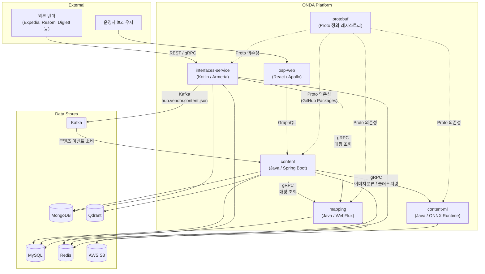
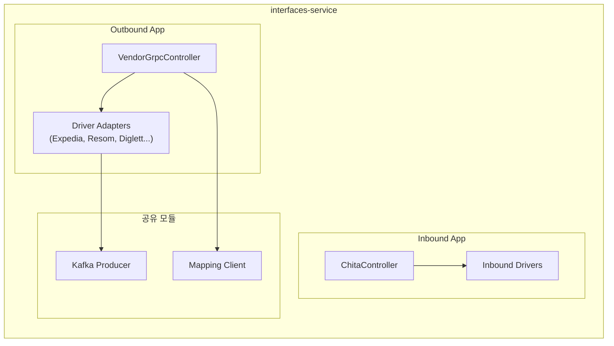
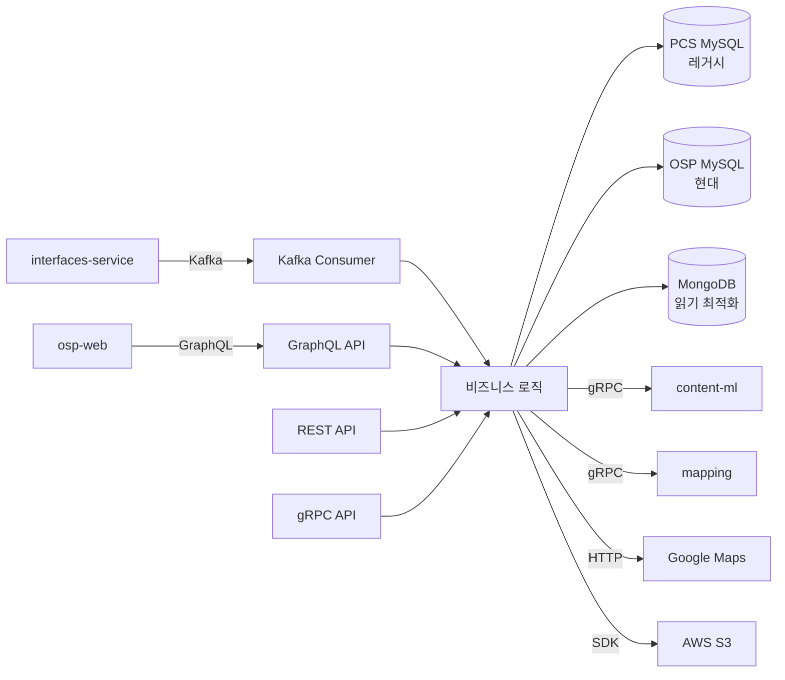
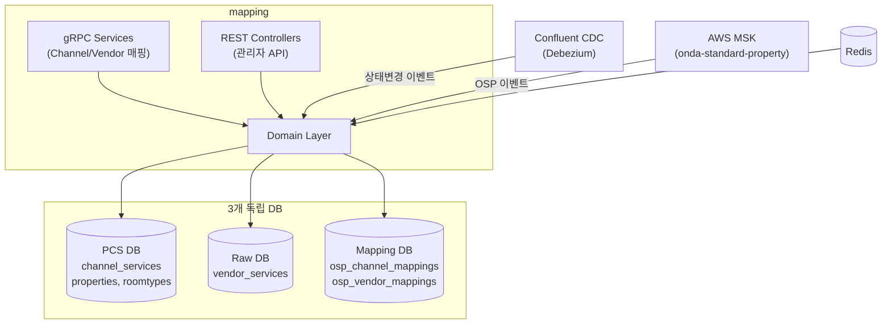
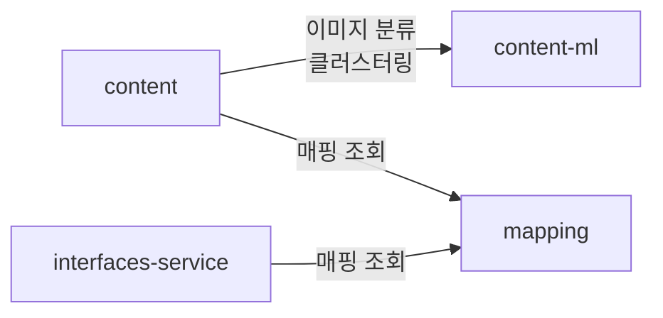
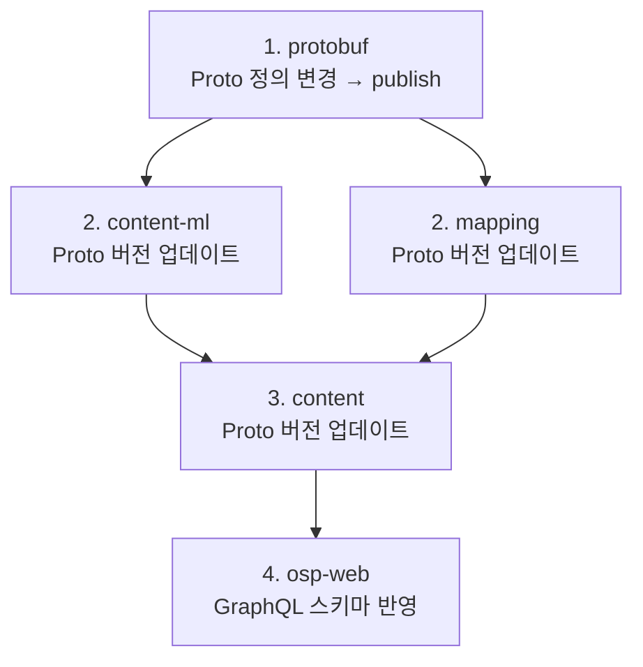

# ONDA 마이크로서비스 인수인계 문서

## 1. 시스템 전체 아키텍처

---

## 2. 서비스별 개요

### 2.1 protobuf — gRPC 계약 레지스트리

| 항목 | 내용 |
|------|------|
| **경로** | `/Projects/protobuf` (github.com/tportio/protobuf) |
| **역할** | 모든 서비스 간 gRPC 통신 계약(Proto 파일)을 중앙 관리. Java/Node.js 코드를 생성하여 GitHub Packages / S3로 배포 |
| **기술** | Protobuf 3.25.3, gRPC 1.62.2, Gradle (Java), npm (TS) |
| **현재 버전** | Java: `me.onda:protobuf:1.4.0`, TS: `@tportio/protobuf` |

**Proto 구조:**

| 디렉토리 | 용도 |
|----------|------|
| `proto/hub/content/v1/` | content, content-ml 서비스 계약 (숙소, 이미지, 클러스터링) |
| `proto/hub/booking/v1/` | 예약 관리 |
| `proto/hub/vendor/v1/` | 벤더 인터페이스 |
| `proto/hub/channel/v1/` | 채널 운영 |
| `proto/hub/common/` | 공통 데이터 타입 (요금, 편의시설, 프로모션 등 50+ 파일) |
| `proto/onda/mapping/v1/` | 매핑 서비스 계약 |
| `proto/onda/notification/v1/` | 알림 채널 (앱, 이메일, SMS, 카카오) |
| `proto/gds/` | GDS(Global Distribution System) 연동 |

**배포 흐름:** proto 파일 수정 → `./gradlew publish` (Java) / `npm run publish` (TS) → 하위 서비스에서 의존성 버전 업데이트

---

### 2.2 interfaces-service — 벤더 통합 게이트웨이

| 항목 | 내용 |
|------|------|
| **경로** | `/Projects/interfaces-service` (github.com/tportio/interfaces-service) |
| **역할** | ONDA ↔ 외부 벤더 간 통합 게이트웨이. Outbound(ONDA→벤더), Inbound(판매채널→ONDA) 이중 구조 |
| **기술** | Kotlin 2.0, Spring Boot 3.2.5, Armeria, gRPC, Kafka, MySQL, MongoDB, Redis |
| **포트** | 8080 (REST), 50051 (gRPC) |

**이중 앱 구조:**

- **Outbound App** (`apps/outbound`): ONDA에서 벤더로 나가는 요청 처리
  - gRPC 서비스: PropertyContent, Availability, PriceCheck, Booking CRUD
  - 벤더별 어댑터(Driver) 패턴으로 10+ 벤더 지원
- **Inbound App** (`apps/inbound`): 외부 판매채널에서 들어오는 요청 처리 (Chita B2B 프로토콜)

**Kafka 발행:**
- `hub.vendor.content.json` — 벤더 숙소/객실/요금 콘텐츠 이벤트 → content 서비스가 소비
- `hub.vendor.region.json` — 벤더 지역 데이터 이벤트

---

### 2.3 content — 숙소 콘텐츠 관리 서비스

| 항목 | 내용 |
|------|------|
| **경로** | `/Projects/content` (github.com/tportio/content) |
| **역할** | ONDA 핵심 콘텐츠 서비스. 공급사 데이터 수신 → 정규화/저장 → 판매채널 및 운영 프론트엔드에 API 제공 |
| **기술** | Java 21, Spring Boot 3.2, GraphQL, gRPC, Kafka, MySQL, MongoDB, Qdrant, Redis |

**데이터 흐름:**

**핵심 역할:**
1. Kafka로 interfaces-service에서 벤더 콘텐츠 이벤트 수신
2. PCS (레거시) + OSP (현대) 이중 MySQL 저장
3. MongoDB에 프레젠테이션 최적화 데이터 동기화
4. **GraphQL API로 osp-web 프론트엔드에 데이터 제공**
5. gRPC/REST API로 다른 서비스에 데이터 제공

**외부 호출:**
- content-ml (gRPC): 이미지 분류, 임베딩, 객실 클러스터링
- mapping (gRPC): 숙소/객실 매핑 조회
- Google Maps API: 지오코딩, 주소 검증
- AWS S3: 이미지 저장

---

### 2.4 content-ml — ML 추론 서비스

| 항목 | 내용 |
|------|------|
| **경로** | `/Projects/content-ml` (github.com/tportio/content-ml) |
| **역할** | ONNX Runtime 기반 AI/ML 추론 엔진. content 서비스의 ML 백엔드 |
| **기술** | Java 21, Spring Boot 3.3, gRPC, ONNX Runtime 1.18, HuggingFace Tokenizers, Smile ML |
| **포트** | 50051 (gRPC), 8080 (REST) |

**제공 기능:**

| 기능 | 모델 | 설명 |
|------|------|------|
| 이미지 임베딩 | DINOv2 | 1024차원 특성 벡터 추출 |
| 이미지 분류 | DINOv2 + 분류 헤드 | 객실 유형 분류 (침실, 거실, 욕실 등) |
| 이미지 유사도 | Siamese Network | 이미지 유사도 행렬 계산 |
| 텍스트 유사도 | KLUE-BERT | 객실명 유사도 행렬 계산 |
| 객실 클러스터링 | Spectral Clustering | 이미지+텍스트 유사도 기반 객실 자동 그룹핑 |

**통신:** gRPC (Unary + Server-side streaming). content 서비스에서만 호출됨.

**주의:** JVM 힙 4GB+ 필요 (ONNX 모델 로딩). 모델 파일은 `src/main/resources/models/`에 위치.

---

### 2.5 mapping — 숙소 매핑 관리 서비스

| 항목 | 내용 |
|------|------|
| **경로** | `/Projects/mapping` (github.com/tportio/mapping) |
| **역할** | OSP ↔ PCS ↔ Vendor 간 숙소/객실/요금제 매핑 상태 관리 |
| **기술** | Java 21, Spring Boot 3.2, WebFlux(Netty), R2DBC, jOOQ, gRPC, Kafka, Redis |
| **포트** | 8080 (REST), 9090 (gRPC) |

**핵심 특징: 완전 리액티브 아키텍처**

**3단계 매핑:** Property → RoomType → RatePlan (각각 Channel/Vendor 양방향)

**주의사항:**
- `@Transactional`에 반드시 `transactionManager` 지정 필요 (3개 DB)
- R2DBC + jOOQ 조합: jOOQ 결과는 `Flux.from()` / `Mono.from()`으로 래핑 필수
- Master/Slave 라우팅: `R2dbcRoutingConnectionFactory` 사용

---

### 2.6 osp-web — 운영 관리 웹 프론트엔드

| 항목 | 내용 |
|------|------|
| **경로** | `/Projects/osp-web` (github.com/tportio/osp-web) |
| **역할** | 표준 숙소(OSP) 운영 관리 SPA. 숙소 관리, 이미지 관리, 자동 그룹핑 등 |
| **기술** | React 19, TypeScript, Apollo Client 3.13, Tailwind CSS, Cypress |
| **통신** | content 서비스의 GraphQL API에 Apollo Client로 연결 |
| **인증** | Google OAuth 2.0 → JWT 토큰 |

**주요 페이지:**

| 경로 | 기능 |
|------|------|
| `/unmapped` | 미매핑 숙소 목록 (기본 홈) |
| `/standard` | 표준 숙소 목록 |
| `/standard/:propertyId` | 표준 숙소 상세 |
| `/auto-grouping` | ML 기반 자동 그룹핑 규칙 관리 |
| `/automation-review` | 자동화 검토 |
| `/images` | 이미지 관리 |
| `/code` | 코드(분류) 관리 |

---

## 3. 서비스 간 통신 요약

### 동기 통신 (gRPC)

| 호출자 | 피호출자 | 프로토 | 용도 |
|--------|---------|--------|------|
| content | content-ml | `content_ml_service.proto` | 이미지 분류, 임베딩, 클러스터링 |
| content | mapping | `mapping_service.proto` | 숙소/객실 매핑 조회 |
| interfaces-service | mapping | `mapping_service.proto` | 매핑 조회 |

### 비동기 통신 (Kafka)

| 발행자 | 토픽 | 소비자 | 내용 |
|--------|------|--------|------|
| interfaces-service | `hub.vendor.content.json` | content | 벤더 숙소/객실/요금 이벤트 |
| interfaces-service | `hub.vendor.region.json` | content | 벤더 지역 데이터 |
| Confluent CDC | `cdc.json.hub.pcs.*` | mapping | DB 변경 이벤트 (상태 추적) |
| AWS MSK | `onda-standard-property` | mapping | OSP 속성 이벤트 |

### GraphQL 통신

| 클라이언트 | 서버 | 용도 |
|-----------|------|------|
| osp-web | content | 숙소/객실 CRUD, 이미지 관리, 자동 그룹핑 등 운영 기능 |

---

## 4. 배포 순서 (의존성 기반)

서비스 간 계약(Proto, GraphQL 스키마)에 변경이 있을 경우:

계약 변경이 없는 내부 로직만의 수정은 각 서비스 독립 배포 가능.

---

## 5. 공통 패턴 및 규칙

| 항목 | 내용 |
|------|------|
| **언어** | 문서/주석은 한글, 기술 용어는 영문 병기 |
| **커밋** | `[AI]` 태그 포함, 비트리비얼한 변경에 `AIDEV-NOTE:` 앵커 주석 |
| **컨테이너** | Jib으로 Docker 이미지 빌드 (전체 백엔드) |
| **Proto 배포** | GitHub Packages (Java), S3 (TS) |
| **테스트** | Testcontainers (MySQL, Kafka, Redis) 기반 통합 테스트 |
| **커버리지** | JaCoCo - content 80%, mapping 75% |
| **AI 가이드** | 모든 서비스에 `CLAUDE.md` 또는 `AGENTS.md` 존재 |

---

## 6. 주요 저장소 및 외부 시스템

| 저장소/시스템 | 사용 서비스 | 용도 |
|-------------|-----------|------|
| MySQL | content, mapping, interfaces-service | 주 데이터 저장소 |
| MongoDB | content, interfaces-service | 읽기 최적화 / 드라이버별 데이터 |
| Redis | content, mapping, interfaces-service | 캐싱 |
| Qdrant | content | 벡터 검색 (임베딩 기반) |
| AWS S3 | content, content-ml | 이미지 저장/조회 |
| Confluent Kafka | mapping | CDC 이벤트 |
| AWS MSK | mapping | OSP 이벤트 |

---

## 7. GitHub

- **조직:** `tportio` (github.com/tportio)
- 각 서비스는 독립 레포지토리로 관리
