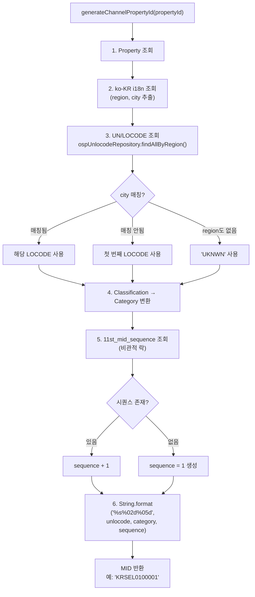
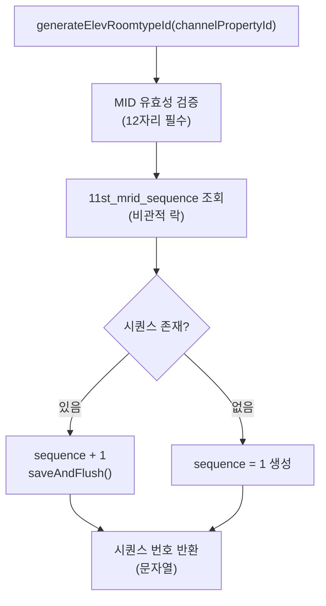
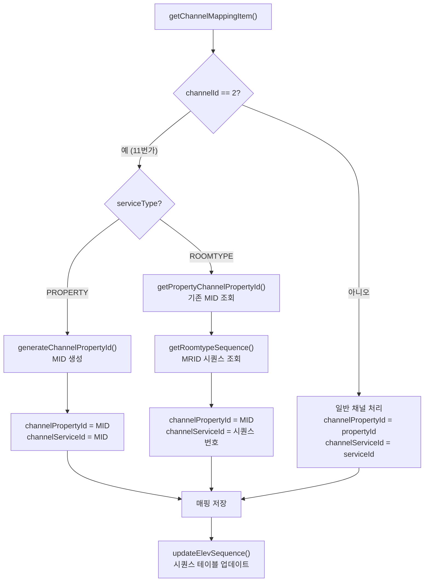

# 11번가(ELEV) 채널 연동 상세 문서

> content 서비스 내 11번가 채널 전용 로직을 설명하는 문서

## 개요

11번가(코드명: ELEV, `channelId = 2`)는 ONDA 플랫폼의 판매 채널 중 하나로, **자체적인 숙소/객실 ID 체계**를 사용한다. 다른 채널과 달리 ONDA 내부 ID를 그대로 쓰지 않고, UN/LOCODE 기반의 고유한 ID를 생성하여 매핑해야 한다.

이 문서는 content 서비스(`OspChannelService`)에 구현된 11번가 전용 로직을 다룬다.

---

## 핵심 개념

### MID (숙소 ID)

11번가에서 사용하는 숙소 식별자. 12자리 문자열.

```
KRSEL0100001
├────┤├┤├───┤
  │    │   │
  │    │   └── sequence (5자리, 0-패딩)
  │    └────── category (2자리, 0-패딩)
  └─────────── UN/LOCODE (5자리)
```

| 구성 요소 | 길이 | 설명 |
|-----------|------|------|
| UN/LOCODE | 5자리 | 지역 코드 (예: `KRSEL` = 한국 서울) |
| Category | 2자리 | 숙소 분류 (1~7) |
| Sequence | 5자리 | 해당 지역+분류 내 일련번호 |

### MRID (객실 ID)

숙소(MID) 하위의 객실 일련번호. MID를 기준으로 순차 증가하는 정수값.

---

## 데이터베이스 테이블

### `11st_codes`

OSP 코드 → 11번가 코드 매핑 테이블.

```sql
CREATE TABLE osp.`11st_codes` (
  code_id INT UNSIGNED NOT NULL PRIMARY KEY,
  name    VARCHAR(5) NOT NULL
);
```

GraphQL `CodeType.elevCode` 필드에 노출된다.

### `11st_mid_sequence`

MID 시퀀스 관리. UN/LOCODE + Category 조합별로 다음 일련번호를 추적한다.

```sql
CREATE TABLE osp.`11st_mid_sequence` (
  unlocode CHAR(5) NOT NULL,
  category DECIMAL(2) UNSIGNED ZEROFILL NOT NULL,
  sequence INT(5) UNSIGNED ZEROFILL NOT NULL,
  PRIMARY KEY (unlocode, category)
);
```

### `11st_mrid_sequence`

MRID 시퀀스 관리. MID별로 다음 객실 일련번호를 추적한다.

```sql
CREATE TABLE osp.`11st_mrid_sequence` (
  `11st_mid` CHAR(12) NOT NULL PRIMARY KEY,
  sequence   INT UNSIGNED NOT NULL
);
```

---

## MID 생성 로직

`OspChannelService.generateChannelPropertyId()` 메서드가 담당한다.



### Classification → Category 매핑

숙소의 `classificationId`를 11번가 카테고리(1~7)로 변환한다.

| Category | Classification IDs | 숙소 유형 |
|----------|--------------------|-----------|
| 1 | 9 | - |
| 2 | 10, 11 | - |
| 3 | 12 | - |
| 4 | 13, 14 | - |
| 5 | 15 | - |
| 6 | 16, 17 | - |
| 7 | 18 | - |

유효 범위: `classificationId` 9~18. 범위 밖이면 예외 발생.

---

## MRID 생성 로직

`OspChannelService.generateElevRoomtypeId()` 메서드가 담당한다.



---

## GraphQL 인터페이스

### Query

#### `channelServiceIds`

토큰 기반 인증으로 채널의 숙소/객실 서비스 ID를 조회한다.

```graphql
channelServiceIds(ids: [Int!]!, serviceType: ServiceTypeEnum!): [ChannelServiceIdType!]!
```

- `Authorization` 헤더에서 채널 정보를 추출 (`channelId`)
- `channelId = 2`(11번가)일 경우, 매핑 상태(`ENABLED`/`DISABLED`)와 무관하게 **모든 매핑**을 반환

```graphql
type ChannelServiceIdType {
    id: Int!                    # Property ID 또는 Roomtype ID
    channelServiceId: String    # 채널에서 사용하는 서비스 ID
}
```

### Mutation

#### `manualElevChannelPropertyId`

이미 생성된 11번가 숙소 ID(MID)를 새로운 ID로 재생성한다.

```graphql
manualElevChannelPropertyId(propertyId: Int!, user: String!): Boolean!
```

**동작:**
1. `channelId = 2` 매핑 조회
2. 없으면 `NotFoundChannelMapping` 예외
3. `generateChannelPropertyId()`로 새 MID 생성
4. 기존 매핑 삭제 → 새 매핑 INSERT (복합 PK 변경 불가하므로 삭제 후 재생성)

#### `manualChannelMapping`

채널 화이트리스트 기반 수동 채널 매핑 생성. 11번가 포함 모든 채널에서 사용.

```graphql
manualChannelMapping(propertyId: Int!, user: String!, channelId: Int): Boolean!
```

`channelId = 2`일 경우 내부적으로 MID/MRID 자동 생성 로직이 작동한다.

### Type

#### `CodeType.elevCode`

코드 조회 시 11번가 전용 코드명을 함께 반환한다.

```graphql
type CodeType {
    id: Int!
    name: String!
    type: CodeTypeEnum
    elevCode: String!    # 11st_codes 테이블에서 JOIN
    localizedName: String
    parentId: Int
    locale: String
}
```

---

## 채널 매핑 흐름 (11번가 전용 분기)

`OspChannelService.getChannelMappingItem()`에서 `channelId == 2`일 때 분기 처리된다.



---

## 11번가 전용 예외 처리

### 매핑 상태 무시

`OspChannelMappingService.getOspServiceIdsByServiceIds()`:

```java
// channelId = 2 (11번가)일 때 ENABLED 필터를 적용하지 않음
if (channelId != 2) {
    mappings = mappings.stream()
            .filter(m -> m.getMappingStatus().name().equals("ENABLED"))
            .collect(Collectors.toList());
}
```

다른 채널은 `ENABLED` 상태의 매핑만 반환하지만, 11번가는 **모든 상태의 매핑을 반환**한다. 레거시 주석에 따르면 "11번가는 채널 맵핑 상태와 삭제여부를 리스트 단계에서 확인할 수 없음".

### 동시성 제어

MID/MRID 시퀀스 테이블은 **비관적 쓰기 락**(Pessimistic Write Lock)으로 보호된다.

```java
// Repository 예시
@Lock(LockModeType.PESSIMISTIC_WRITE)
Optional<Osp11stMidSequenceEntity> findByUnlocodeAndCategory(String unlocode, Integer category);
```

동시에 같은 지역+카테고리의 숙소가 매핑될 때 시퀀스 충돌을 방지한다.

---

## 관련 파일 목록

| 계층 | 파일 |
|------|------|
| **GraphQL 스키마** | `src/main/resources/graphql/schema.graphqls` |
| **Resolver** | `src/main/java/.../presentation/gql/resolver/ChannelResolver.java` |
| **서비스 (핵심)** | `src/main/java/.../service/osp/OspChannelService.java` |
| **서비스 (매핑 조회)** | `src/main/java/.../service/osp/OspChannelMappingService.java` |
| **Entity - MID 시퀀스** | `modules/datastores/.../entity/Osp11stMidSequenceEntity.java` |
| **Entity - MRID 시퀀스** | `modules/datastores/.../entity/Osp11stMridSequenceEntity.java` |
| **Entity - 코드** | `modules/datastores/.../entity/Osp11stCodesEntity.java` |
| **Repository - MID** | `modules/datastores/.../repository/Osp11stMidSequenceRepository.java` |
| **Repository - MRID** | `modules/datastores/.../repository/Osp11stMridSequenceRepository.java` |
| **DTO** | `src/main/java/.../presentation/gql/dto/Code.java` (`elevCode` 필드) |
| **상수** | `common/.../constant/CommonConstant.java` (`DEFAULT_SELLER_NAME = "11st"`) |

---

## 요약

| 항목 | 내용 |
|------|------|
| **채널 ID** | `2` (하드코딩) |
| **숙소 ID (MID)** | 12자리: `LOCODE(5) + Category(2) + Sequence(5)` |
| **객실 ID (MRID)** | MID 기준 순차 증가 정수 |
| **동시성** | 비관적 쓰기 락 (DB 레벨) |
| **매핑 상태** | 다른 채널과 달리 ENABLED 필터 미적용 |
| **코드 매핑** | `11st_codes` 테이블 → `CodeType.elevCode` 필드 |
