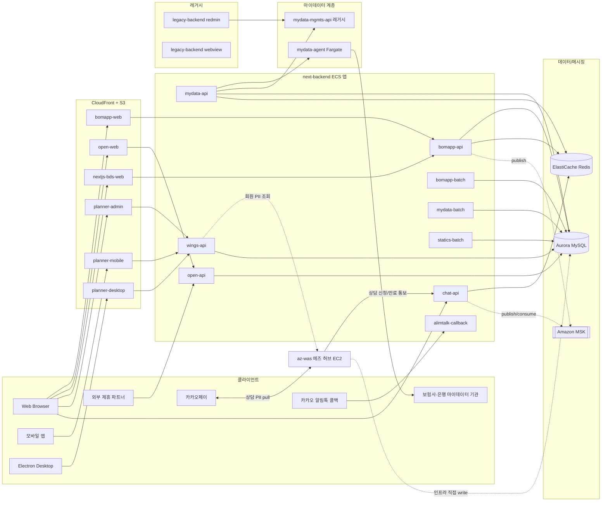

# BOMAPP 시스템 아키텍처

> 보맵(BOMAPP) 보험 상품 도메인 마이크로서비스 플랫폼의 전체 구조와 상호 의존 관계를 정리한 문서.
> 이 문서는 Terraform 코드(`../infra`), 각 서비스 리포지토리, 그리고 노션 운영 문서를 종합하여 작성되었으며,
> 각 서비스의 상세는 [services/](./services/) 하위 문서를 참조한다.
>
> ⚠️ **단정 vs 검증된 사실 구분**: 본 문서는 코드/문서 종합 추론을 포함한다. SSM/AWS CLI 로 직접 검증된 사실만 정리한 단일 진실원은 [`runtime-verification.md`](./runtime-verification.md) 를 참조.

---

## 1. 도메인 개요

보맵은 **보험 상품**을 핵심 도메인으로 한다. 다음 영역의 서비스를 운영한다.

- **보험 상품 검색·분석·추천** — 일반 고객 대상 상품 비교 및 가입 동선
- **마이데이터 기반 자산/보장 분석** — 마이데이터 동의 → 정보 수집 → 보장 분석
- **설계사 도구(Wings / Planner)** — 설계사용 PC/모바일/웹 앱 + 어드민
- **실시간 채팅 상담** — 설계사↔고객 SockJS+STOMP 채팅
- **알림톡(카카오) 마케팅 자동화** — 갱신·만기·상담 알림
- **외부 파트너 연동** — 카카오페이, 보험사 OpenAPI, 건강검진 등

---

## 2. AWS 환경

| 항목 | 값 |
|------|----|
| 계정 ID | `044488971141` |
| 리전 | `ap-northeast-2` (Seoul) |
| IaC | Terraform 1.5.7 / AWS Provider 5.100.0 |
| 배포 형태 | ECS EC2 Launch Type 위주 (`mydata-agent` 만 Fargate) |

### 2.1 VPC / 환경 분리

| 환경 | VPC ID | CIDR | 비고 |
|------|--------|------|------|
| DEV | `vpc-00a0692c94e2d9340` | `10.90.0.0/16` | 독립 VPC |
| STG | `vpc-0c1947d3152076528` | `10.1.0.0/16` | PROD VPC 공유, 클러스터/서브넷으로 분리 |
| PROD | `vpc-0c1947d3152076528` | `10.1.0.0/16` | (STG 와 동일 VPC) |

### 2.2 서브넷

```
DEV VPC (10.90.0.0/16)
├─ SBN-Dev-Cluster-was-zone-a   10.90.200.0/24  (ap-northeast-2a)  ECS
├─ SBN-Dev-Cluster-was-zone-b   10.90.201.0/24  (ap-northeast-2b)  ECS
├─ SBN-dev-lb-zone-a            10.90.90.0/25   (2a)               ALB
└─ SBN-dev-lb-zone-b            10.90.90.128/25 (2b)               ALB

PROD VPC (10.1.0.0/16) — STG와 공유
├─ SBN-STG-Cluster-was-zone-a   10.1.210.0/24   (2a)  STG ECS
├─ SBN-STG-Cluster-was-zone-b   10.1.211.0/24   (2b)  STG ECS
├─ SBN-PROD-Cluster-was-zone-a  10.1.220.0/24   (2a)  PROD ECS
└─ SBN-PROD-Cluster-was-zone-b  10.1.221.0/24   (2b)  PROD ECS
```

### 2.3 온프레미스 / VPC 간 라우팅

VGW(Virtual Gateway) 를 통해 다음 대역과 연동:

| 대역 | 용도 |
|------|------|
| `172.16.100.0/24` | 온프레미스(HQ 내부 — GitLab/Grafana/Prometheus/Elastic) |
| `192.168.100.0/24` | HQ 사내망 |
| `192.168.200.0/24` | VDI |
| `10.0.77.0/24` | SSL VPN |

DEV VPC ↔ PROD/STG VPC 간 통신도 VGW 경유.

---

## 3. 네트워크 진입점 (Edge → 서비스)

### 3.1 진입 흐름 다이어그램

```
                  ┌──────────────────────────────────────────────┐
                  │                Internet                      │
                  └──────────────────────────────────────────────┘
                                       │
                ┌──────────────────────┼──────────────────────┐
                │                      │                      │
        Route53 (bomapp.co.kr)   Route53 (bomapp.im)   ACM Certs
                │                      │
        ┌───────┴───────┐      ┌──────┴──────┐
        │   PROD-NLB    │      │   DEV-NLB   │
        │   (TCP 통과)  │      │  (TCP 통과) │
        └───────┬───────┘      └──────┬──────┘
                │                     │
        ┌───────┴───────┐      ┌──────┴──────┐
        │   PROD-ALB    │      │   DEV-ALB   │
        │   (HTTP/L7)   │      │  (HTTP/L7)  │
        └───┬───────┬───┘      └──────┬──────┘
            │       │                 │
   (host header rules: sapi/wapi/mapi/oapi/...)
            │       │                 │
            ▼       ▼                 ▼
    ┌───────────────────────────────────────┐
    │  ECS Target Groups (IP / Instance)    │
    └───────────────────────────────────────┘
                       │
                       ▼
    ┌───────────────────────────────────────┐
    │  ECS Tasks (next-backend / chat-api / │
    │   mydata-api / wings-api / batches)   │
    └───────────────────────────────────────┘

    ─────────────────── Internal-only ───────────────────
    ECS Task ──▶ PROD-Internal-ALB ──▶  mydata-agent (Fargate)
                                    └─▶ gateway:14000
                                    └─▶ stg-int-mapi / stg-bbatch / ...

    ─────────────────── Static frontends ───────────────────
    Browser ──▶ Route53 (Alias) ──▶ CloudFront ──▶ S3 buckets
                                    (bomapp-static-{env}-{app})
```

### 3.2 로드밸런서 카탈로그

| LB | 타입 | 위치 | 주요 포트 | Access Log | 비고 |
|----|------|------|----------|-----------|------|
| `dev-nlb` | NLB | 인터넷 | 80/82/443 | `s3://bomapp-access-logs/dev-nlb` | DEV ALB 앞단 TCP 통과 |
| `dev-alb` | ALB | DEV VPC | 80/443/6379/8005/8081 | `s3://bomapp-access-logs/dev-alb` | DEV 진입 |
| `prod-nlb` | NLB | 인터넷 | 80/443/3001/3002/5443 | `s3://bomapp-access-logs/prod-nlb` | PROD ALB 앞단 |
| `prod-alb` | ALB | PROD VPC | 80/443/3001/3002/5443 | `s3://bomapp-access-logs/prod-alb` | PROD 진입 |
| `prod-internal-alb` | ALB | PROD VPC (private) | 443/8080/14000 | `s3://aws-logs.bomapp.co.kr` | 내부 전용 (mydata-agent, gateway, batch) |

ACM 인증서: `bomapp_multi_wildcard` (`certificate/e1d770a3-...`) 가 대부분의 listener 에 사용됨.

---

## 4. 서비스 카탈로그 (요약)

서비스 상세는 [`services/`](./services/) 하위 각 문서 참조.

| 서비스 | 유형 | 언어/프레임워크 | 활동 상태 | 상세 |
|--------|------|---------------|----------|------|
| [infra](./services/infra.md) | IaC | Terraform 1.5.7 | 활발 (2026-04 신규) | AWS ECS/RDS/ALB/CloudFront 관리 |
| [next-backend](./services/next-backend.md) | 백엔드 (모노레포) | Java 21 / Spring Boot 3.4 | **활발** | 9개 ECS 앱 (API 5 + Batch 3 + Webhook 1) |
| [next-frontend](./services/next-frontend.md) | 프론트엔드 (모노레포) | Vue 3 / Vite / Yarn | **활발** | 6개 앱 (web/open/planner-* /admin/bds) |
| [az-was](./services/az-was.md) | 백엔드 (파트너 연동) | Java 21 / Spring Boot 3.2.5 | **활발** | 카카오페이 상담 허브 + 설문 수집. 에즈(AZ) 운영 EC2. **GitLab 정본** |
| [mydata-agent](./services/mydata-agent.md) | 백엔드 | Java 17 / Spring WebFlux | 유지보수 | 마이데이터 mTLS 게이트웨이 (Fargate) |
| [mydata-mgmts-api](./services/mydata-mgmts-api.md) | 백엔드 | Java 11 / Spring Boot 2.3 | **이관 중 (레거시)** | 마이데이터 동의/관리 (mydata-api 로 이관) |
| [legacy-backend](./services/legacy-backend.md) | 모놀리스 | Java 1.8 / Spring Boot 1.5 | **동결 (2024-08)** | redmin / webview 만 잔존, API는 next-backend 로 이관 완료 |

---

## 5. 의존 관계 (서비스 그래프)

### 5.1 런타임 호출 그래프



### 5.2 의존성 매트릭스

| 호출자 → | next-backend API 들 | mydata-agent | mydata-mgmts-api | 외부 파트너 |
|----------|--------------------|--------------|----------------|------------|
| next-frontend (web/admin/planner-*) | ✓ (REST) | | | |
| next-backend / mydata-api | | ✓ (REST, Internal-ALB) | ✓ (REST, 추정 Feign) | ✓ 마이데이터 기관 (간접) |
| next-backend / open-api | | | | ✓ 카카오페이 등 (v4) |
| next-backend / chat-api | | | | ✓ Infobank, MSK |
| legacy-backend / redmin | | | ✓ (직접 호출) | |
| 외부 카카오 | (alimtalk-callback) | | | |
| 마이데이터 기관 | | (mTLS 응답) | | |

> **`*-internal` 도메인 (예: `int-mapi.bomapp.co.kr`, `magent.bomapp.co.kr`)** 은 PROD-Internal-ALB 를 통해 VPC 내부에서만 호출 가능하며, 인증·인가가 외부 도메인보다 가벼운 경우가 있다. 변경 시 보안 영향 검토 필수.

---

## 6. 도메인 매핑 종합표

> 환경별 호스트 네임 → 대상 서비스 매핑. 환경 prefix(`dev-`/`stg-`/없음=PROD) 외 패턴이 일관적이지 않은 도메인이 많으므로 변경 작업 전 반드시 확인.

### 6.1 외부 노출 (Public)

> ⚠️ **PROD-BACK 운영 주의**: 다음 도메인 다수가 PROD-BACK 클러스터의 `next-backend-was:1.1` 컨테이너 내부 포트로 라우팅되는데, 이 컨테이너는 단일 Spring Boot 앱이 아니라 **호스트 `/was/data` 가 마운트된 공용 WAS 패턴**으로 여러 jar 가 수동 운영된다. "next-backend / legacy" 라벨은 SSM 검증으로 확인된 listening jar 기준이며, 미검증 항목은 caveat 표시. 자세한 검증 결과는 [`runtime-verification.md §3`](./runtime-verification.md#3-호스트-헤더--실제-jar-매핑-검증) 참조.

| 도메인 (PROD) | DEV | STG | 컨테이너 포트 | 실제 listening jar (검증) |
|--------------|-----|-----|:---:|----------------------|
| `bapi.bomapp.co.kr` | `dev-bapi.bomapp.co.kr` | `stg-bapi.bomapp.co.kr` | 8107 | **next-backend / bomapp-api** (`bomapp-server-bomapp-api.jar`, PID 10745) ✓ |
| `web.bomapp.co.kr` | (별도) | (별도) | 7778 | **legacy-backend / bomapp_webview_server** (`bomapp_webview_server-0.1.0.jar`, PID 1428) ✓ |
| `wapi.bomapp.co.kr` | `dev-wapi.bomapp.co.kr` | `stg-wings-api.bomapp.co.kr` | 8102 | **next-backend / wings-api** (`bomapp-server-wings-api.jar`, PID 19422) ✓ |
| `oapi.bomapp.co.kr` / `openapi.bomapp.co.kr` | `dev-oapi`/`dev-openapi` | `stg-oapi.bomapp.co.kr` | 8105 | **next-backend / open-api** (`bomapp-server-open-api.jar`, PID 5953) ✓ |
| ~~`mapi.bomapp.co.kr` (`mapi1`, `mapi2`)~~ | `dev-mapi.bomapp.co.kr` | `stg-mapi.bomapp.co.kr` | — | **2026-06-01 정리 — PROD `mapi`/`mapi1`/`mapi2` 룰+TG+DNS 완전 삭제 (BOM-99)**. 근거: 30일(05-02~06-01) 외부 요청 0건 + 대상 TG 등록 타깃 0개(이미 비기능). 실 마이데이터 트래픽은 내부 `int-mapi.bomapp.co.kr`(4,563,564건/30일)로 정상 — **외부 진입 경로만 폐기, mydata-api 서비스는 운영 중**. dev/stg는 유지 |
| `vkey.bomapp.co.kr` | — | — | 8080 | **bomapp-vkey** (Tomcat 9.0.45 WAR, `bm.service=bomapp_key`, PID 1205) ✓ — TouchEn transkeyServlet (라온시큐어 가상키보드 복호화, 청구 플로우 주민번호 입력용). 별개 프로젝트 [`bomapp-inc/transkey_servlet`](https://github.com/bomapp-inc/transkey_servlet). [상세 서비스 문서](./services/bomapp-vkey.md) |
| `redmin.bomapp.co.kr` | `dev-rapi.bomapp.co.kr` | — | 7575 | (`bomapp-redmin-prod` 디렉토리 존재하나 ps 비활성, 다른 인스턴스 미검증) |
| (chat) | `dev-chat.bomapp.co.kr`, `dev-chat-api.bomapp.co.kr` | `stg-chat.bomapp.co.kr` | — | **chat-api** (DEV/STG/PROD-Cluster 내 service `SVC-ECS-{ENV}-chat-api`; 과거 별도 `PROD-Chat` 클러스터에서 통합됨) |
| `az.bomappworks.com` | — | — | 3001 (frontend ALB) | legacy az frontend |
| ~~`api.bomapp.co.kr`~~ | — | — | — | **2026-05-07 정리 — fixed-response 410** (이전 8107 forward) |
| ~~`my-data-cbt.bomapp.co.kr`~~ | — | — | — | **2026-05-07 정리 — fixed-response 410** |
| ~~`wapi1.bomapp.co.kr`~~, ~~`wapi2.bomapp.co.kr`~~ | — | — | — | **2026-06-01 정리 — 룰+TG+DNS 완전 삭제 (BOM-99)**. wings-api 인스턴스별 재기동 훅(`GET /open/server/restart/wings-api-prod`, 구 8102 per-instance 경로)이었으나 30일 각 1건(사내 운영 curl)뿐. 활성 `wapi`는 신규 IP-target TG(`prod-wings-api-ip-8080`)로 이관 완료 → 재기동은 표준 ECS 배포 경로로 대체 |

### 6.2 내부 전용 (PROD-Internal-ALB)

| 도메인 | 대상 서비스 | 포트 |
|--------|------------|------|
| `int-mapi.bomapp.co.kr` (`stg-int-mapi`) | mydata-api 내부 | :8080 |
| `magent.bomapp.co.kr` (`stg-magent`) | **mydata-agent** | :8080 |
| `gateway.bomapp.co.kr` (`stg-gateway`) | gateway | :14000 |
| `stg-bbatch.bomapp.co.kr` | bomapp-batch | — |
| `stg-mbatch.bomapp.co.kr` | mydata-batch | — |
| `stg-vapi.bomapp.co.kr` | wings/vkey 내부 | — |

### 6.3 정적 프론트엔드 (CloudFront + S3)

| 도메인 (DEV) | 도메인 (STG) | 도메인 (PROD) | 앱 | S3 버킷 |
|-------------|-------------|--------------|-----|---------|
| `dev-web.bomapp.co.kr` | `stg-web.bomapp.co.kr` | (PROD: `az.bomappworks.com` 등) | bomapp-web | `bomapp-static-{env}-web` |
| `dev-open.bomapp.co.kr` | — | — | open-web | `bomapp-static-dev-web` (공유) |
| `dev-padmin.bomapp.co.kr` | `stg-padmin.bomapp.co.kr` | — | planner-admin | `bomapp-static-{env}-padmin` |
| `dev-planner.bomapp.co.kr` | `stg-planner.bomapp.co.kr` | — | planner-desktop | `bomapp-static-{env}-planner` |
| `dev-dplanner.bomapp.co.kr` | `stg-dplanner.bomapp.co.kr` | — | planner-mobile | `bomapp-static-{env}-dplanner` |

### 6.4 직접 호스트 (레거시 IP 라우팅, 정리 대상)

| 도메인 | IP | 대상 |
|--------|----|------|
| `api-was1.bomapp.co.kr` | `10.1.1.10` | 레거시 backend |
| `api-was2.bomapp.co.kr` | `10.1.1.20` | 레거시 backend |
| `mapi-was1.bomapp.co.kr` | `10.1.1.17` | 레거시 mydata-api |
| `mapi-was2.bomapp.co.kr` | `10.1.1.194` | 레거시 mydata-api |
| `batch-was.bomapp.co.kr` | `10.1.1.116` | 레거시 batch |
| `next-stg-back.bomapp.co.kr`, `stg-was.bomapp.co.kr` | `10.1.1.149` | STG backend |
| `front-was.bomapp.co.kr` | `10.1.110.34` | 레거시 frontend |

### 6.5 운영/관제 도메인

| 도메인 | 대상 |
|--------|------|
| `mail.bomapp.co.kr` | SMTP 메일 (`14.52.60.172`) |
| `sslvpn.bomapp.im` | SSL VPN |
| `grafana.bomapp.co.kr`, `prometheus.bomapp.co.kr`, `elastic.bomapp.co.kr` | 온프레미스 모니터링 (`172.16.100.240`) |
| `mattermost.bomapp.co.kr` | 사내 채팅 |
| `prod-az-db.bomapp.co.kr`, `stg-az-db.bomapp.co.kr`, `dev-az-db.bomapp.co.kr` | Aurora RDS endpoint |

---

## 7. ECS 클러스터 / Capacity Provider

> **2026-05-19 재검증** (`aws ecs list-clusters` + `describe-clusters/services/container-instances`). 과거 분리되어 있던 NEXT-DEV / NEXT-STG / stg-Chat / PROD_NEXT_BAPI / PROD-Chat 5개 클러스터가 사라지고, **DEV/STG/PROD-Cluster 가 next-backend 와 legacy 앱을 통합 호스팅** 하는 형태로 재편되었다. 노드 인스턴스 타입도 전부 **m7g.xlarge (ARM Graviton)** 으로 통일.

| 클러스터 | 환경 | 인스턴스 | Capacity Provider | running tasks | 호스팅 서비스 |
|---------|------|---------|-------------------|:-:|--------------|
| `DEV-Cluster` | DEV | m7g.xlarge × 1 | `CP-ECS-DEV` + FARGATE + FARGATE_SPOT | 9 | bomapp-api, mydata-api, mydata-agent, mydata-batch, bomapp-batch, statics-batch, open-api, wings-api, chat-api, alimtalk-callback, legacy-bomapp-api, bomapp-redmin, bomapp-webview, planner-card-ssr, recipient-extractor (15개 서비스) |
| `STG-Cluster` | STG | m7g.xlarge × 1 | `CP-ECS-STG` + FARGATE + FARGATE_SPOT | 7 | 동일 (15개 서비스) |
| `PROD-Cluster` | PROD | m7g.xlarge × 4 | `CP-ECS-PROD` + FARGATE + FARGATE_SPOT | 9 | 14개 서비스 — DEV/STG 와 동일하되 `recipient-extractor` 부재 |
| `PROD-BACK` | PROD | t3.xlarge × 2 | (capacity provider 없음, EC2 직접) | 2 | **공용 WAS 컨테이너** (`next-backend-was:1.1` 이미지, `/was/data` 마운트) — 12개 디렉토리 / 7개 활성 jar 수동 운영. ECS service: `prod-next-backend-was-v5/v6`. **bomapp-vkey 등 레거시 jar 가 단일 컨테이너에 공존** ([상세](./runtime-verification.md#2-prod-back-클러스터-운영-실체-ssm-검증)) |
| `PROD-FRONT-NEXT` | PROD | 1 instance | (EC2 직접) | 1 | next-frontend WAS |
| `PROD-MYDATA-API-240522-ARM` | PROD | m7g.xlarge × 2 (추정 — ARM Graviton) | `Infra-ECS-Cluster-PROD-MYDATA-API-240522-ARM-...-EC2CapacityProvider` | 2 | mydata-api 전용 (PROD 만) |
| `PROD-MYDATA-AGENT-240523-ARM` | PROD | — | FARGATE + FARGATE_SPOT | 2 | mydata-agent 전용 (PROD 만, Fargate 만) |
| `NEXT-PROD-BATCH-II` | PROD | 1 instance | `Infra-ECS-Cluster-NEXT-PROD-BATCH-II-...-EC2CapacityProvider` | 1 | next batch |

> **참고**: PROD 환경에서 `mydata-api` / `mydata-agent` 는 PROD-Cluster 의 service 외에 별도 ARM 클러스터(`PROD-MYDATA-API-240522-ARM`, `PROD-MYDATA-AGENT-240523-ARM`)에서도 가동된다. 트래픽이 어느 쪽으로 흐르는지는 `architecture.md §6.2` 의 ALB 라우팅 참조.

명명 규칙: `SVC-ECS-{ENV}-{앱이름}`, Task Definition: `TD-ECS-{ENV}-{앱이름}`, Task Role: `{env}-{앱이름}-task-role`. 모든 서비스가 `launchType` 대신 `capacityProviderStrategy` 사용.

### 7.1 신규 서비스 배포 시 권장 클러스터

- **EC2 capacity provider 가 필요한 경우** (자원/네트워크 격리 등): DEV-Cluster / STG-Cluster / PROD-Cluster 에 `CP-ECS-{ENV}` 로 추가.
- **Fargate 격리가 필요한 경우** (예: bomapp-vkey 분리 배포): 동일 클러스터의 `FARGATE` capacity provider 사용 — 신규 클러스터 신설 불필요.
- **레거시 격리**: `PROD-BACK` 의 공용 WAS 컨테이너는 **신규 서비스 추가 금지**. 기존 jar 들도 점진 이관 대상.

---

## 8. 데이터 플레인

| 컴포넌트 | 사용 서비스 | 비고 |
|---------|------------|------|
| **Aurora MySQL (RDS)** | next-backend 전 앱, legacy-backend, mydata-mgmts-api | DEV/STG/PROD 환경별. Terraform 미관리 (수동) |
| **ElastiCache Redis (Serverless, TLS)** | next-backend (Redisson), chat-api, mydata-mgmts-api | 과거 PROD-Chat 전용 + 공용으로 분리되어 있었으나 클러스터 통합 후 재검증 필요. 현재 Redis 인스턴스 구성은 2026-05-19 시점에 확인되지 않음. |
| **Amazon MSK (Kafka, SASL/SCRAM)** | chat-api (`chat-message`, `chat-status`), next-backend 일부 | `b-*.prodmskcluster.c4.kafka.ap-northeast-2.amazonaws.com:9096` |
| **AWS Secrets Manager** | next-backend (Spring Cloud AWS, dev/stg/prod 환경별) | 2026-04 정식 적용 |

---

## 9. 외부 시스템 연동

next-backend `bomapp-external-*` 모듈로 추상화된 14개 외부 의존성:

| 시스템 | 모듈 | 용도 |
|--------|------|------|
| AZ 전산 (`cs/az.azlife.kr`) | `external-az` | 설계사 조직·권한·실적 동기화 + 상담 등록/배정 (AES payload) |
| 에즈 [az-was](./services/az-was.md) (`az.bomapp.co.kr`) | `external-az-managed` | **카카오페이 상담 허브** — 회원 PII 조회·설문 토큰/상태. az-was→보맵 으로 상담 신청/만료도 역호출 |
| Braze | `external-braze` | 푸시 알림 마케팅 |
| Channel Talk | `external-channeltalk` | 고객 지원 채팅 |
| Coocon | `external-coocon` | 문서/계약 서명 |
| From Age (v1/v2) | `external-fromage`, `external-fromagev2` | 건강검진 분석 |
| G&NET | `external-gnnet` | 보험사 기간계 (보험료 조회 등) |
| InfoBank | `external-infobank` | SMS / 카카오톡 / 결제 |
| Manos | `external-manos` | 결제 보증 |
| Raon | `external-raon` | 결제 정보 암호화 |
| Slack | `external-slack` | 내부 알림 |
| 마이데이터 종합포털 | `external-mydata`, `external-mydataapi` | 동의/조회 통합 |

마이데이터 기관 직접 통신은 `mydata-agent` 가 mTLS 로 담당.

---

## 10. CI/CD 개요

| 서비스 | 도구 | 빌드 산출물 |
|--------|------|------------|
| next-backend | GitHub Actions | Jib 멀티아키 OCI 이미지 (amd64/arm64) → ECR |
| next-frontend | GitLab CI/CD | Vite 정적 빌드 → S3 + CloudFront 무효화 |
| mydata-agent | (수동, GitHub Actions 없음) | Gradle jar |
| mydata-mgmts-api | (수동) | Maven jar |
| legacy-backend | (수동) | Maven WAR |
| az-was | **Jenkins** (GitLab 소스) | Gradle jar → EC2 직접배포(scp+nohup), PROD 2대 ALB drain 무중단 |
| infra | Terraform CLI 수동 (`terraform apply -target ...`) | — |

CI 가 운영하는 GitLab(온프레미스 `172.16.100.244`) 와 GitHub(`github.com/bomapp/*`)이 혼재되어 있다. 노션 자료에 따르면 SCM 메인은 GitLab.

---

## 11. 알려진 이슈 / 마이그레이션 상태

infra 의 ECS 감사(2026-04-06) 와 운영 문서에서 도출된 핵심 이슈:

### P0 (즉시 조치 필요)
- **PROD 로깅 미설정**: `prod-next-backend-was v7/v8`, `prod-next-frontend-was`, `prod-mydata-api` 등 4개 태스크에 awslogs 드라이버 없음
- **SSH 포트 22 노출**: 6개 PROD 태스크에 SSH 포트가 외부에 열려 있음 (ECS Exec 으로 대체 권장)

### P1 (1~2주)
- **헬스체크 미설정**: PROD 8개 서비스 중 7개 누락
- **IAM Task Role 미설정**: `backend-was v7/8`, `mydata-api` 등에 Execution Role / Task Role 없음
- **Circuit Breaker 미활성**: PROD-BACK, PROD-FRONT-NEXT
- **chat-api 이미지 태그 `latest` 사용** (롤백 불가)

### P2 (1개월)
- 오토스케일링 추가 (5개 서비스)
- Container Insights 활성화 (3개 클러스터)

### P3 (분기)
- **클러스터 통합 13 → 6** (현재 환경별/서비스별로 과도하게 분산)
- **STG mydata-api 가 레거시 호스트(10.1.1.194 등) 가리킴** — next-backend 전환 미완
- **alimtalk-callback PROD ECS 미배포**
- **bomapp-api PROD 가 PROD-Cluster 가 아닌 PROD-BACK(legacy 모놀리스) 에 27개 포트로 떠 있음** — 마이크로서비스 분리 미완
- **Service Discovery (CloudMap HTTP namespace)** 만 생성, 실제 등록은 미완

### 유휴 리소스 (월 ~$167)
- PROD-Cluster m7g.xlarge × 4, STG-Cluster m7g.xlarge × 1, DEV-Cluster m7g.xlarge × 1 (2026-05-19 확인. 모두 ARM Graviton, capacity provider `CP-ECS-{ENV}` + Fargate)
- 미사용 Target Group 25개 (`target_groups.tf` 하단 주석)

### Terraform 미관리
- RDS, MSK, S3 일부, WAF, VPC 라우팅, NAT Gateway, IGW, ACM 일부

### 마이그레이션 진행
| From | To | 상태 |
|------|-----|------|
| `legacy-backend/bomapp_api_server` | `next-backend/bomapp-api` | 노션상 "이전 완료" 진술 있음. 단 PROD-BACK `/was/data` 에 `legacy-bomapp-api-prod` 디렉토리 잔존 (ps 비활성) — 완전 제거는 미확정 |
| `legacy-backend/bomapp_webview_server` | next-backend (또는 정적 사이트) | **활용 중** — 7일 정상 호출 확인. 약관/정책 51개 + 공지 + 콘텐츠 + 이벤트 + FAQ + 흥국GIBS 등 67개 endpoint. 보맵 안드로이드 앱이 `web.bomapp.co.kr` 를 호출 |
| `mydata-mgmts-api` | `next-backend/mydata-api` | 진행 중. PROD-BACK 컨테이너에 `bomappmydata-0.0.1-SNAPSHOT.jar` (PID 15890) 활성 |
| 수동 인프라 | Terraform | 진행 중 (2026-04 시작) |
| `api.bomapp.co.kr`, `my-data-cbt.bomapp.co.kr` | 폐기 (410 Gone) | **2026-05-07 정리 완료** ([근거](./runtime-verification.md#43-apibomappcokr-정리-전-7일-분포)) |

---

## 12. 환경 변수 / 시크릿 관리

- 신규: **AWS Secrets Manager** + Spring Cloud AWS 3.3.1 (`spring.config.import: aws-secretsmanager:`)
- 레거시: Task Definition 환경변수 평문 (예: `AZ_WAS_INTERNAL_TOKEN`) — Secrets Manager 로 이전 필요
- 환경 분리: `dev` / `stg` / `prod` 프로필별 `application-{profile}.yml`

---

## 13. 관련 문서

- 본 디렉토리 [services/](./services/) — 각 서비스 상세 ([az-was](./services/az-was.md) 포함)
- [`./kakaopay-az-bomapp-flow.md`](./kakaopay-az-bomapp-flow.md) — 카카오페이↔에즈(az-was)↔보맵 3자 통신 규약/플로우
- [`./runtime-verification.md §11`](./runtime-verification.md) — az-was↔보맵 공유-DB 방향 AWS 실측
- `../infra/CLAUDE.md` — Terraform 작업 규정 (destroy 금지, prevent_destroy 등)
- `../infra/docs/network-diagram.md` — 네트워크 1차 자료
- `../infra/ecs-audit-report-20260406.md` — ECS 감사 리포트 (P0~P3)
- `../infra/service-discovery-plan.md` — Service Connect / Private DNS 도입 계획
- `../infra/rds-migration-plan-r6g.md` — RDS r6g 이행 계획
- 노션: `BOMAPP 인프라 구조(HQ/AWS)`, `AWS ECS 구성 점검 리포트`, `ECS 아키텍처 구성 정리`

---

> 본 문서의 정확성은 분석 시점(2026-05-07)의 코드/Terraform/노션 스냅샷 기준이다. 실제 운영 시 항상 `terraform state` 와 AWS 콘솔의 현재 상태를 함께 확인할 것.
