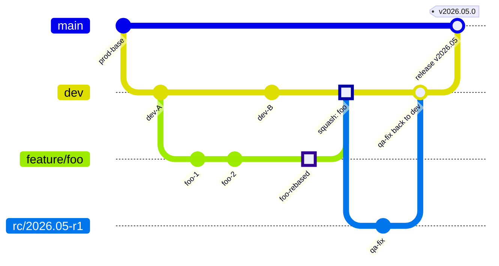
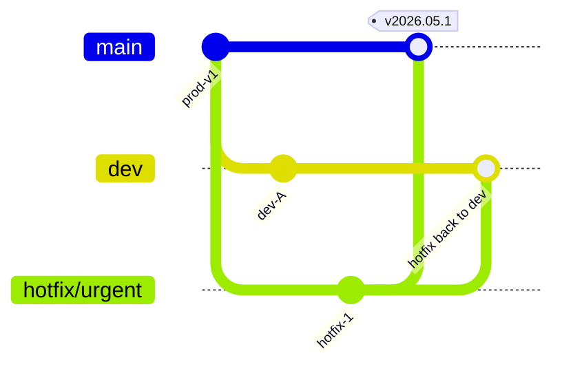

# Git 브랜치 전략

> 베이스: **Git Flow** (https://nvie.com/posts/a-successful-git-branching-model/)
> 작성일: 2026-05-12

본 문서는 `next-backend` 저장소에서 사용하는 Git 브랜치 운영 규칙을 정의한다.
**Git Flow를 기본으로 하되, 아래 “추가/변형 규칙”을 우선 적용한다.**

---

## 1. 브랜치 종류

| 분류 | 브랜치 이름 | 역할 | 수명 |
|------|------------|------|------|
| 메인 | **`prod`** | 운영(production) 배포 기준 브랜치. Git Flow의 `main`/`master` 역할 | 영구 |
| 메인 | **`dev`** | 다음 릴리즈에 들어갈 변경사항이 통합되는 개발 브랜치. Git Flow의 `develop` 역할 | 영구 |
| 보조 | **`feature/*`** | 단일 기능/이슈 단위 작업 브랜치. `dev`에서 분기, `dev`로 머지 | 단명 |
| 보조 | **`rc/*`** | QA용 릴리즈 후보(release candidate) 브랜치. Git Flow의 `release/*` 역할을 대체 | 단명 |
| 보조 | **`hotfix/*`** | `prod`에서 분기되는 긴급 수정 브랜치. `prod`와 `dev` 양쪽으로 머지 | 단명 |

> 브랜치 명명 규칙 예시
> - `feature/BOM-123-mydata-detail`
> - `rc/2026.05-r1`, `rc/2026.05-r2` (필요 시 같은 시점에 복수 존재 가능)
> - `hotfix/BOM-456-token-leak`

---

## 2. 추가/변형 규칙 (Git Flow와 다른 부분)

이 절의 규칙은 Git Flow 기본 규칙보다 **우선한다**.

### 규칙 1. 피쳐 브랜치는 PR 전 반드시 `dev` HEAD로 리베이스한다

- 머지 커밋(`git merge dev`)이 아니라 **리베이스(`git rebase origin/dev`)** 를 사용한다.
- 목적: `dev` 히스토리를 선형으로 유지하고, PR diff에 무관한 머지 커밋이 섞이지 않도록 한다.
- 충돌 해결 책임은 피쳐 브랜치 작성자에게 있다.

```bash
git fetch origin
git checkout feature/BOM-123-foo
git rebase origin/dev
# 충돌 해결 후
git push --force-with-lease
```

> `--force-with-lease`를 사용해 동료의 푸시를 덮어쓰지 않도록 한다.

### 규칙 2. 피쳐 브랜치는 스쿼시 머지(squash merge)할 수 있다

- 피쳐 PR을 `dev`에 머지할 때 **squash merge**를 허용한다.
- 단일 PR이 단일 의미 단위의 커밋이 되므로 `dev` 히스토리가 깔끔하게 유지된다.
- 작업 도중 만들어진 “wip”, “fix typo” 등의 잡 커밋이 영구 히스토리에 남지 않는다.
- 스쿼시 커밋 메시지는 PR 제목/본문을 기준으로 정리한다.

> 머지 후 로컬/원격 피쳐 브랜치는 즉시 삭제한다.

### 규칙 3. 릴리즈 브랜치는 `rc/*` 로 대체하며, **`dev` → `prod`** 로 직접 머지한다

- Git Flow의 `release/*` 브랜치 대신 **`rc/*`** 브랜치를 사용한다.
- `rc/*` 는 **QA를 위한 임시 브랜치**이며, 배포 버전에 따라 **여러 개가 동시에 존재할 수 있다**.
  - 예: 5월 정기 릴리즈 QA 중 `rc/2026.05-r1`이 있고, 동시에 다음 스프린트 QA용 `rc/2026.05-r2`가 만들어질 수 있다.
- `rc/*` 는 `dev`의 특정 시점을 잘라 QA 환경에 올리기 위한 스냅샷이다. **`rc` 자체를 `prod` 로 머지하지 않는다.**
- QA가 통과되면 **`dev` 브랜치를 그대로 `prod` 로 머지**하여 배포한다.
  - 이유: `rc` 머지 시점 이후 `dev`에 핫픽스성 후속 커밋이 들어갈 수 있고, 진실 공급원(single source of truth)은 항상 `dev`이기 때문이다.
- QA 중 `rc/*` 에서 발견된 버그는
  1. `dev`에 먼저 수정 PR을 머지하고,
  2. 해당 커밋(들)을 `rc/*` 로 cherry-pick 하여 재검증한다.
- 릴리즈 완료 후 `rc/*` 브랜치는 삭제한다.

---

## 3. 그 외에는 Git Flow 규칙을 따른다

명시되지 않은 사항은 Git Flow 기본 규칙을 적용한다. 요약:

- **`feature/*`**: `dev`에서 분기 → `dev`로 머지 (위 규칙 1, 2 적용).
- **`hotfix/*`**: `prod`에서 분기 → **`prod`와 `dev` 양쪽으로 머지**. 운영 장애 대응 외에는 사용하지 않는다.
- **`prod`로의 직접 푸시 금지**: `prod`는 항상 `dev` 또는 `hotfix/*` 머지로만 갱신된다.
- **태깅**: `prod`로 머지된 릴리즈 커밋에는 버전 태그(`v2026.05.0` 등)를 부여한다.

---

## 4. 전체 흐름 다이어그램

### 4.1 일반 릴리즈 흐름



> 위 다이어그램의 `main` 트랙은 본 저장소의 **`prod`** 브랜치를 의미한다 (Mermaid `gitGraph` 표기상 메인 트랙 이름이 `main`).
> `feature/foo`는 `dev` HEAD로 리베이스 후(`foo-rebased`) 스쿼시 머지된다.
> `rc/2026.05-r1`은 QA용이며 `prod`로 직접 머지되지 않는다. QA에서 발견된 수정은 `dev`로 돌아가고, 최종적으로 `dev`가 `prod`로 머지된다.

### 4.2 핫픽스 흐름



> 핫픽스는 `prod`(다이어그램의 `main`)에서 분기되어 `prod`와 `dev` 양쪽으로 머지된다.

---

## 5. 운영상 체크리스트

PR 머지 전:

- [ ] 피쳐 브랜치가 `origin/dev` HEAD로 리베이스되어 있는가?
- [ ] CI(테스트/빌드) 통과 여부 확인
- [ ] 리뷰 승인 1인 이상
- [ ] 스쿼시 머지 시 커밋 메시지(=PR 제목/본문)가 의미 단위로 정리되어 있는가?

릴리즈(prod 머지) 전:

- [ ] `rc/*` 에서 QA 통과 확인
- [ ] QA 중 수정 사항이 모두 `dev`에도 반영되었는가? (cherry-pick 누락 점검)
- [ ] `prod` 머지 후 버전 태그 부여
- [ ] `rc/*` 브랜치 삭제

---

## 6. 부록: 자주 쓰는 명령어

```bash
# 1) 피쳐 시작
git fetch origin
git checkout -b feature/BOM-123-foo origin/dev

# 2) PR 전 dev 리베이스
git fetch origin
git rebase origin/dev
git push --force-with-lease

# 3) RC 브랜치 생성 (릴리즈 매니저)
git fetch origin
git checkout -b rc/2026.05-r1 origin/dev
git push -u origin rc/2026.05-r1

# 4) RC에서 발견된 버그 → dev 먼저 머지 후 cherry-pick
git checkout rc/2026.05-r1
git cherry-pick <commit-sha-from-dev>
git push

# 5) 릴리즈: dev → prod
git checkout prod
git pull
git merge --no-ff origin/dev
git tag v2026.05.0
git push origin prod --tags
```
