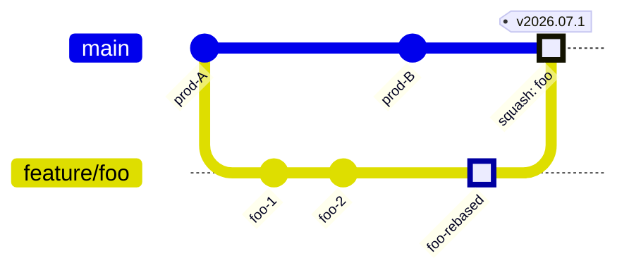
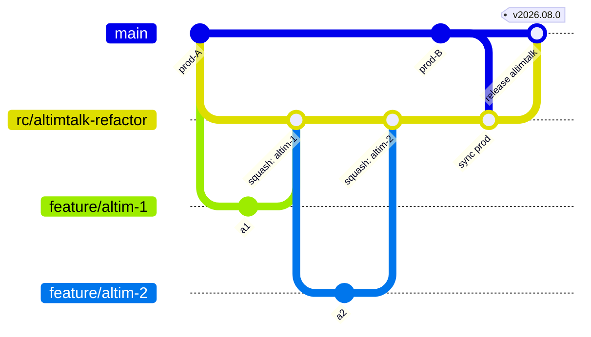
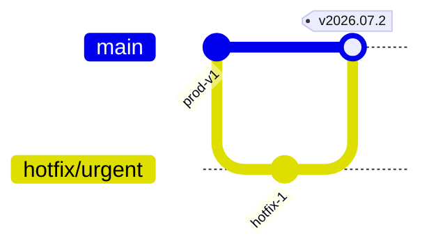

# Git 브랜치 전략

> 베이스: **Trunk-Based Development / GitHub Flow** (트렁크 = `prod` 단일 영구 브랜치)
> 작성일: 2026-05-12 · 개정: 2026-07-06 (`dev` 통합 브랜치 제거, `prod` 단일 트렁크로 전환)

본 문서는 저장소에서 사용하는 Git 브랜치 운영 규칙을 정의한다.
**`prod`를 유일한 영구 브랜치(트렁크)로 두고, 모든 작업 브랜치는 `prod`에서 분기해 `prod`로 돌아온다.**

---

## 1. 브랜치 종류

| 분류 | 브랜치 이름 | 역할 | 수명 |
|------|------------|------|------|
| 메인 | **`prod`** | 운영(production) 배포 기준이자 **유일한 통합 브랜치**(트렁크). 항상 배포 가능한 상태를 유지 | 영구 |
| 보조 | **`feature/*`** | 단일 기능/이슈 단위 작업 브랜치. `prod`에서 분기, `prod`로 머지 | 단명 |
| 보조 | **`rc/*`** | **여러 PR로 나뉘는 큰 작업(예: 알림톡 리팩토링)** 을 모으는 장수(長壽) 통합 브랜치. `prod`에서 분기, 완성되면 `prod`로 머지 | 중장기 |
| 보조 | **`hotfix/*`** | 긴급 운영 수정 브랜치. `prod`에서 분기, `prod`로 머지 (`feature/*`와 메커니즘은 같고 긴급도만 다름) | 단명 |

> 브랜치 명명 규칙 예시
> - `feature/BOM-123-mydata-detail`
> - `rc/altimtalk-refactor` (큰 작업 이름으로 명명. 릴리즈 스냅샷이 아니라 **작업 묶음** 단위)
> - `hotfix/BOM-456-token-leak`

---

## 2. 핵심 규칙

### 규칙 1. 작업 브랜치는 PR 전 반드시 `prod` HEAD로 리베이스한다

- 머지 커밋(`git merge prod`)이 아니라 **리베이스(`git rebase origin/prod`)** 를 사용한다.
- 목적: `prod` 히스토리를 선형으로 유지하고, PR diff에 무관한 머지 커밋이 섞이지 않도록 한다.
- 충돌 해결 책임은 작업 브랜치 작성자에게 있다.

```bash
git fetch origin
git checkout feature/BOM-123-foo
git rebase origin/prod
# 충돌 해결 후
git push --force-with-lease
```

> `--force-with-lease`를 사용해 동료의 푸시를 덮어쓰지 않도록 한다.

### 규칙 2. 피쳐 브랜치는 스쿼시 머지(squash merge)할 수 있다

- 피쳐 PR을 `prod`에 머지할 때 **squash merge**를 허용한다.
- 단일 PR이 단일 의미 단위의 커밋이 되므로 `prod` 히스토리가 깔끔하게 유지된다.
- 작업 도중 만들어진 “wip”, “fix typo” 등의 잡 커밋이 영구 히스토리에 남지 않는다.
- 스쿼시 커밋 메시지는 PR 제목/본문을 기준으로 정리한다.

> 머지 후 로컬/원격 피쳐 브랜치는 즉시 삭제한다.

### 규칙 3. `prod`는 항상 배포 가능해야 한다 (트렁크 규율)

- `dev` 같은 완충 통합 브랜치가 없으므로 **`prod`로의 머지 = 배포 후보**다.
- **미완성/미리뷰 코드는 절대 `prod`에 머지하지 않는다.** 모든 PR은 CI(테스트/빌드) 통과 + 리뷰 승인 후에만 머지한다.
- **`prod`로의 직접 푸시 금지**: `prod`는 항상 PR 머지로만 갱신된다.
- 아직 켜면 안 되는 미완성 기능이 트렁크에 들어가야 한다면 **피쳐 플래그(토글)로 꺼둔 채** 머지한다.
- **태깅**: `prod`로 머지된 릴리즈 커밋에는 버전 태그(`v2026.07.0` 등)를 부여한다.

### 규칙 4. 큰 작업은 `rc/*` 장수 브랜치에 모은다

- 여러 PR·수 주에 걸치는 큰 작업(예: 알림톡 리팩토링)은 트렁크를 깨지 않기 위해 `prod`에서 `rc/<작업이름>`을 따서 그 아래에 모은다.
- 세부 작업 브랜치는 **`rc/*`에서 분기 → `rc/*`로 머지**한다 (PR base = 해당 `rc/*`).
- `rc/*`는 여러 사람이 공유하는 브랜치이므로, 최신화는 **리베이스가 아니라 `prod`를 `rc/*`로 머지**해서 한다 (공유 브랜치 강제 푸시 금지).
  ```bash
  git checkout rc/altimtalk-refactor
  git merge origin/prod      # 주기적으로 trunk 변경분 흡수
  git push
  ```
- 작업이 완성되고 QA를 통과하면 **`rc/*` → `prod`** 로 머지한다.
  - 큰 작업 묶음을 히스토리에 하나의 흐름으로 남기고 싶으면 `--no-ff` 머지, 단일 커밋으로 압축하고 싶으면 squash — 팀 합의에 따른다.
- 머지 완료 후 `rc/*` 브랜치는 삭제한다.

---

## 3. 브랜치별 요약

- **`feature/*`**: `prod`에서 분기 → `prod`로 머지 (규칙 1, 2 적용).
- **`rc/*`**: `prod`에서 분기 → 세부 작업을 모음 → 완성 시 `prod`로 머지 (규칙 4).
- **`hotfix/*`**: `prod`에서 분기 → `prod`로 머지. 운영 장애 대응 등 긴급 건에 사용.
- **`prod`로의 직접 푸시 금지**: 항상 PR 머지로만 갱신된다.

---

## 4. 전체 흐름 다이어그램

> 아래 다이어그램의 `main` 트랙은 본 저장소의 **`prod`** 브랜치를 의미한다 (Mermaid `gitGraph` 표기상 메인 트랙 이름이 `main`).

### 4.1 일반 피쳐 흐름



> `feature/foo`는 `prod`에서 분기 → `prod` HEAD로 리베이스(`foo-rebased`) → 스쿼시 머지된다.

### 4.2 큰 작업(`rc/*`) 흐름



> 세부 작업은 `rc/*`에 모으고, 트렁크 변경분은 `prod`를 `rc/*`로 머지해 흡수한다. 완성 후 `rc/*`를 `prod`로 머지한다.

### 4.3 핫픽스 흐름



> 핫픽스는 `prod`에서 분기되어 `prod`로 머지된다. `dev` 백머지가 필요 없다 (트렁크가 하나뿐).

---

## 5. 운영상 체크리스트

PR 머지 전:

- [ ] 작업 브랜치가 `origin/prod` HEAD로 리베이스되어 있는가? (`rc/*` 세부 작업은 `origin/rc/*` 기준)
- [ ] CI(테스트/빌드) 통과 여부 확인
- [ ] 리뷰 승인 1인 이상
- [ ] 스쿼시 머지 시 커밋 메시지(=PR 제목/본문)가 의미 단위로 정리되어 있는가?
- [ ] 미완성 기능이면 피쳐 플래그로 꺼진 상태인가?

릴리즈(prod 머지) 후:

- [ ] `prod` 머지 커밋에 버전 태그 부여
- [ ] 머지된 `feature/*` / 완료된 `rc/*` 브랜치 삭제

---

## 6. 부록: 자주 쓰는 명령어

```bash
# 1) 피쳐 시작
git fetch origin
git checkout -b feature/BOM-123-foo origin/prod

# 2) PR 전 prod 리베이스
git fetch origin
git rebase origin/prod
git push --force-with-lease

# 3) 큰 작업용 rc 브랜치 생성
git fetch origin
git checkout -b rc/altimtalk-refactor origin/prod
git push -u origin rc/altimtalk-refactor

#    - rc 밑 세부 작업은 rc에서 분기해서 rc로 PR
git checkout -b feature/altim-1 origin/rc/altimtalk-refactor

#    - rc를 최신 prod로 동기화 (리베이스 X, 머지 O)
git checkout rc/altimtalk-refactor
git merge origin/prod
git push

# 4) 릴리즈: feature/rc → prod (PR 머지 권장. 아래는 로컬 예시)
git checkout prod
git pull
git merge --no-ff origin/rc/altimtalk-refactor
git tag v2026.08.0
git push origin prod --tags
```
