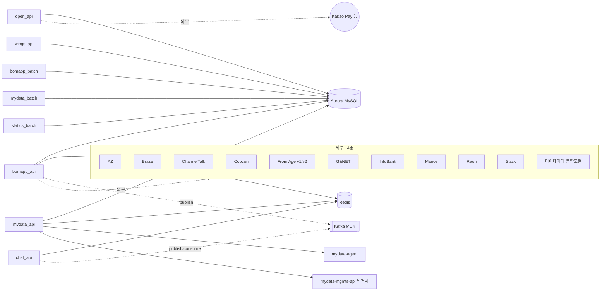

# next-backend

> BOMAPP 차세대 백엔드 모노레포. Gradle 멀티모듈로 9개 마이크로서비스 앱(API 5 + Batch 3 + Webhook 1)을 단일 리포에서 빌드/배포한다. 보험 상품 도메인의 핵심 비즈니스 로직 담당.

| 항목 | 값 |
|------|----|
| 경로 | `../next-backend` |
| 리포 | **GitLab 정본** `gitlab.bomapp.co.kr/bomapp/next-backend` (project id 40, default `prod`, 2026-06-16 정본 이전). GitHub `bomapp-inc/next-backend` = 레거시 미러(PR 미사용) |
| 언어/플랫폼 | Java 21 / Spring Boot 3.4.12 / Spring Cloud 2024.0.3 |
| 빌드 | Gradle 멀티모듈 + Jib 멀티아키 OCI 이미지 |
| 첫 커밋 | 2022-03-24 |
| 최신 커밋 | 2026-05-06 |
| 총 커밋 수 | 3,808 |
| 최근 6개월 | 742 커밋 |
| 주요 브랜치 | `prod`(HEAD), `stg`, `rc`, `dev` |

> **참고**: 노션의 next-backend 기술스택 페이지(2024년 작성)에는 Java 11 / Spring Boot 2.7.5 라고 되어 있으나, 현재 코드는 Java 21 / SB 3.4 로 업그레이드되어 있다. 노션 문서가 outdated.

---

## 1. 책임

- **보험 상품 검색/분석/추천** API
- **마이데이터 동의 및 정보 조회**
- **설계사 도구**(Wings) API
- **실시간 채팅** (SockJS + STOMP)
- **알림톡 마케팅 자동화** (카카오톡 알림 + 콜백 처리)
- **공개/파트너 API** (카카오페이, 보험사 OpenAPI)
- **배치 처리** (통계, 마이데이터 갱신, 알림톡 모수 추출)

---

## 2. 모듈 구조 (5계층)

```
next-backend/
├── bomapp-core/           # 공통 유틸 (암호화, 예외, 헬퍼)
├── bomapp-internal/       # 공통 설정 (인증, 인가, 인터셉터)
├── bomapp-domain/
│   ├── rds/               # RDS 기반 도메인 모델/리포지토리 (JPA + QueryDSL)
│   └── redis/             # Redis 기반 캐시/도메인
├── bomapp-external/       # 외부 시스템 연동 (14개 모듈, 아래 §6)
└── bomapp-server/
    ├── bomapp-api/        # 메인 REST API
    ├── chat-api/          # WebSocket/STOMP 채팅
    ├── mydata-api/        # 마이데이터 API
    ├── open-api/          # 외부 파트너 공개 API
    ├── wings-api/         # 설계사(Wings) 도구 API
    ├── bomapp-batch/      # 메인 배치
    ├── mydata-batch/      # 마이데이터 갱신 배치
    └── statics-batch/     # 통계 집계 배치
```

> **추가 분리**: 2025-05 `recipient-extractor` 마이크로서비스가 별도로 분리됨 (알림톡 발송 대상 추출 전용, ECS 별도 배포). Terraform 의 `ecs_services_recipient_extractor.tf` 참조.

---

## 3. 앱별 상세

### 3.1 bomapp-api (메인 REST API)

| 항목 | 값 |
|------|----|
| 컨테이너 포트 (DEV/STG) | 8080 |
| **컨테이너 포트 (PROD)** | **8107** (PROD-BACK 공용 WAS 컨테이너 내부에서 jar 형태로 실행) ✓ SSM 검증 |
| desired_count | DEV/STG = 1, PROD = 2 |
| 클러스터 (PROD) | **PROD-BACK** — 공용 WAS 컨테이너 (`/was/data/bomapp-api-prod/`) 안에서 `bomapp-server-bomapp-api.jar` 가 PID 10745 로 실행 ([검증](../runtime-verification.md#24-활성-java-프로세스--포트-매핑-검증)) |

**환경별 도메인**

| 환경 | 외부 도메인 | 진입 | 검증 |
|------|-----------|------|:---:|
| DEV | `dev-bapi.bomapp.co.kr` | DEV-NLB:443 → DEV-ALB → IP TG :8080 | |
| STG | `stg-bapi.bomapp.co.kr` | NLB → ALB → IP TG :8080 | |
| PROD | **`bapi.bomapp.co.kr`** (priority 170) | PROD-NLB → PROD-ALB:443 → TG `prod-back-ecs-host-http-8107` → 컨테이너 :8107 | ✓ |
| PROD (정리됨) | ~~`api.bomapp.co.kr`~~, ~~`my-data-cbt.bomapp.co.kr`~~ | 2026-05-07 fixed-response 410 적용 (정리 전 7일 사용율 0% 정상 트래픽) | ✓ |

**주요 엔드포인트**

| Method | Path | 설명 |
|--------|------|------|
| GET/POST | `/auth/bomapp/*` | 보맵 인증 |
| POST | `/analysis`, `/v2/analysis` | 보장 분석 |
| GET/POST | `/consultations/*` | 상담 |
| GET | `/premiums/*` | 보험료 조회 |
| GET | `/renewal-insurance/*` | 갱신형 보험 |
| POST | `/stg_only/test/alimtalk/recipient-extraction` | 스테이징 테스트 |

### 3.2 chat-api (실시간 채팅)

| 항목 | 값 |
|------|----|
| 컨테이너 포트 | 8080 (REST) + WebSocket |
| 클러스터 (PROD) | **PROD-Cluster** 의 `SVC-ECS-PROD-chat-api` (m7g.xlarge × 4 노드 공유, `CP-ECS-PROD` 또는 Fargate). 과거 `PROD-Chat` 클러스터(c5a.xlarge × 2 별도 VPC)는 2026-05-19 시점에 존재하지 않음. |
| Redis | (과거 PROD-Chat 전용 cache.r7g.large × 3 Multi-AZ ElastiCache. 클러스터 통합 후 현재 구성 미검증 — 변경 시 ElastiCache 인스턴스 확인 필요) |
| Kafka | `chat-message`, `chat-status` 토픽 (MSK SASL/SCRAM) |
| 이미지 태그 | `latest` (P1: 롤백 불가 — 개선 권고) |

**환경별 도메인**
- DEV: `dev-chat.bomapp.co.kr`, `dev-chat-api.bomapp.co.kr`
- STG: `stg-chat.bomapp.co.kr`
- PROD: (별도 도메인 — 노션의 capi/wapi 분리 패턴 기반, draw.io 다이어그램 참조)

**주요 엔드포인트**

| Protocol | Path | 설명 |
|----------|------|------|
| STOMP | `/ws/chat/*` | 실시간 메시지 (WebSocket) |
| REST | `/chats/requested-data` | 채팅 추가 정보 요청 |
| REST | `/consultations/*` | 채팅 기반 상담 |
| REST | `/monitor/*` | 모니터링 |

채팅 이미지는 2026-04 부터 S3 저장으로 전환됨 (`feat/ha/chat-image-S3` 브랜치).

### 3.3 mydata-api (마이데이터 API)

| 항목 | 값 |
|------|----|
| 컨테이너 포트 | 8080 |
| 리소스 | CPU 2048 / Memory 3584 (다른 API 의 2배) |
| 클러스터 (PROD) | `PROD-MYDATA-API-240522-ARM` (ARM64, 2 인스턴스 — 2026-05-19 기준 인스턴스 타입은 `describe-container-instances` 로 추가 확인 필요). 별도로 `PROD-Cluster` 의 `SVC-ECS-PROD-mydata-api` 도 존재 — 트래픽 분배 형태 미검증. |

**환경별 도메인**

| 환경 | 외부 도메인 | 내부 도메인 |
|------|-----------|------------|
| DEV | `dev-mapi.bomapp.co.kr` | `dev-int-mapi.bomapp.co.kr` |
| STG | `stg-mapi.bomapp.co.kr` | `stg-int-mapi.bomapp.co.kr` (현재 레거시 호스트 `10.1.1.194` 가리킴 — 이전 미완) |
| PROD | ~~`mapi.bomapp.co.kr`, `mapi1.bomapp.co.kr`, `mapi2.bomapp.co.kr`~~ (2026-06-01 정리·삭제 — BOM-99, 외부 0건/30일·빈 TG) | `int-mapi.bomapp.co.kr` (실 트래픽 4.56M/30일 — **유지**) |

**주요 엔드포인트**

| Method | Path | 설명 |
|--------|------|------|
| POST | `/api/my-data/v1/integration-authorization/*` | 마이데이터 동의 (v1) |
| POST | `/api/my-data/v2/integration-authorization/*` | 마이데이터 동의 (v2) |
| GET | `/api/mydata-linkage/v1/org/*` | 마이데이터 기관 조회 |
| POST | `/api/mydata/v1/*-information` | 보험 정보 수집 |
| POST | `/v3/mgmts/signup/*` | 마이데이터 가입/통계 |

**의존**: `mydata-agent` (외부 마이데이터 기관 mTLS 통신용 게이트웨이) + `mydata-mgmts-api` (레거시 인증/동의, 이관 진행 중)

> 노션 "마이데이터 정책 정의서": 인증 Flow(보험사 선택→인증서 선택→통합 동의→조회), 타임아웃 20초(목록 10s + 상세 10s), 가입 유효기간 1~5년, 1년 평균 연동률 82% (95,185/116,121).

### 3.4 open-api (외부 파트너 공개 API)

| 항목 | 값 |
|------|----|
| 컨테이너 포트 (DEV/STG) | 8080 |
| **컨테이너 포트 (PROD)** | **8105** (PROD-BACK 공용 WAS 의 `/was/data/open-api-prod/`, `bomapp-server-open-api.jar` PID 5953) ✓ SSM 검증 |
| 사용처 | 카카오페이, 외부 보험사 파트너 |

**환경별 도메인**

| 환경 | 도메인 |
|------|--------|
| DEV | `dev-oapi.bomapp.co.kr`, `dev-openapi.bomapp.co.kr` |
| STG | `stg-oapi.bomapp.co.kr` |
| PROD | `oapi.bomapp.co.kr`, `openapi.bomapp.co.kr` |

**주요 엔드포인트** (v4 OpenAPI)

| Method | Path | 설명 |
|--------|------|------|
| POST | `/v4/oauth-token` | OAuth 토큰 발급 |
| POST | `/v4/withdrawal` | 철회 |
| POST | `/v4/guarantees` | 보장 분석 |
| POST | `/v4/consultation/apply` | 상담 신청 |
| POST | `/v4/consultation/cancel` | 상담 철회 (정의는 있으나 미사용 — 노션) |
| POST | `/external/alimtalk/*` | 알림톡 발송 |
| GET/POST | `/dev_only/*`, `/stg_only/*` | 환경 한정 API |

### 3.5 wings-api (설계사 도구 API)

| 항목 | 값 |
|------|----|
| 컨테이너 포트 | DEV/STG: 8080, **PROD: 8102** ✓ SSM 검증 |
| 클러스터 (PROD) | **PROD-BACK** 공용 WAS 컨테이너의 `/was/data/wings-api-prod/` — `bomapp-server-wings-api.jar` 가 PID 19422 로 실행 |
| 노트 | `TD-ECS-DEV-wings-api:13` 은 ECS 감사에서 **모범 사례**(awslogs/healthcheck/ECS Exec/Task Role/Secrets Manager)로 평가됨. 단 PROD 는 위 공용 WAS 패턴이라 모범 사례 미적용 |

**환경별 도메인**

| 환경 | 도메인 |
|------|--------|
| DEV | `dev-wapi.bomapp.co.kr` |
| STG | `stg-wings-api.bomapp.co.kr` |
| PROD | `wapi.bomapp.co.kr` (구 per-instance 별칭 ~~`wapi1`~~/~~`wapi2`~~ 는 2026-06-01 정리·삭제 — BOM-99. 인스턴스별 재기동 훅이었으며 IP-target TG 이관으로 폐기) |

**주요 엔드포인트**

| Method | Path | 설명 |
|--------|------|------|
| GET/POST | `/auth/*` | 설계사 로그인 |
| GET/POST | `/open/*` | 공개 정보 |
| GET/POST | `/consultations/*` | 상담 관리 |
| POST | `/stat/*` | 설계사 통계 |
| GET/POST | `/insurer-archive-support/*` | 보험사 자료 지원 |

### 3.6 bomapp-batch / mydata-batch / statics-batch

| 항목 | 값 |
|------|----|
| 리소스 | CPU 512 / Memory 1024 |
| desired_count | 1 (모든 환경) |
| 배포 전략 | minimumHealthyPercent=0 / maximumPercent=100 (중복 실행 방지) |
| AZ Rebalancing | DISABLED |
| 내부 도메인 | STG: `stg-bbatch.bomapp.co.kr`, `stg-mbatch.bomapp.co.kr` (Internal-ALB) |

---

## 4. 기술 스택

### 4.1 핵심 라이브러리

| 영역 | 라이브러리 | 버전 |
|------|----------|------|
| 프레임워크 | Spring Boot | 3.4.12 |
| 클라우드 | Spring Cloud | 2024.0.3 |
| AWS | Spring Cloud AWS (Secrets Manager) | 3.3.1 |
| 보안 | Spring Security + JWT | jjwt-jackson 0.12.6 |
| ORM | Spring Data JPA + Hibernate + QueryDSL | 5.0.0 |
| Redis | Redisson | 3.16.4 |
| HTTP 클라이언트 | OpenFeign | (Cloud) |
| Kafka | Spring Kafka (AWS MSK SASL/SCRAM) | (Boot 관리) |
| WebSocket | SockJS + STOMP (chat-api) | — |
| 로깅 | Logbook | 3.9.0 |
| 메트릭 | Micrometer + Elastic APM + CloudWatch | — |
| 빌드 | Jib (OCI 멀티아키 amd64/arm64) | 3.4.3 |
| 알림 | Slack API, Braze SDK | — |

### 4.2 데이터 플레인

| 컴포넌트 | 용도 |
|---------|------|
| **Aurora MySQL (RDS)** | DEV/STG/PROD 환경별. Read replica 지원. (Terraform 미관리) |
| **ElastiCache Redis (Serverless, TLS)** | Redisson 클라이언트, 2026-04 정식 엔드포인트 전환 |
| **Amazon MSK (Kafka, SASL/SCRAM)** | 채팅 메시지, 이벤트 발행 |
| **AWS Secrets Manager** | dev/stg/prod 환경별 민감 정보 (2026-04 정식 적용) |

---

## 5. 의존 관계



---

## 6. 외부 연동 (14개 모듈)

| 모듈 | 시스템 | 용도 |
|------|-------|------|
| `bomapp-external-az` | AZ (보험사) | 보험 상담 프로세싱 |
| `bomapp-external-az-managed` | AZ Managed | 설문/상담 상태 관리 |
| `bomapp-external-braze` | Braze | 푸시 알림 마케팅 |
| `bomapp-external-channeltalk` | Channel Talk | 고객 지원 채팅 |
| `bomapp-external-coocon` | Coocon | 문서/계약 서명 |
| `bomapp-external-fromage` | From Age | 건강검진 분석 v1 |
| `bomapp-external-fromagev2` | From Age v2 | 상세 분석 |
| `bomapp-external-gnnet` | G&NET | 보험사 기간계 (보험료 조회, 영수증) |
| `bomapp-external-infobank` | InfoBank | SMS / 카카오톡 / 결제 |
| `bomapp-external-manos` | Manos | 결제 보증 |
| `bomapp-external-mydata` | 마이데이터 종합포털 | 동의/조회 |
| `bomapp-external-mydataapi` | MyDataAPI 종합 | 마이데이터 통합 인터페이스 |
| `bomapp-external-raon` | Raon | 결제 정보 암호화 |
| `bomapp-external-slack` | Slack | 내부 알림 |

---

## 7. 운영

| 항목 | 내용 |
|------|------|
| Dockerfile | 없음 (Jib 으로 OCI 이미지 직접 빌드) |
| 빌드 | `./gradlew :bomapp-server-{app}:jib` |
| CI | **과도기 듀얼 CI**: GitHub Actions (`.github/workflows/build.yml`, `build-and-deploy.yml`, `ecs-deploy.yml`, `pr-check.yml`) + GitLab CI (`.gitlab-ci.yml`, 사내 `gitlab.bomapp.co.kr` 이전 대비). 양쪽 동일 동작(Jib→ECR→ECS). GitLab 측은 정적 AWS 키(OIDC 불가)·`amazon/aws-cli` entrypoint 우회·AWS CLI v2 번들 설치·ECR 직접 push(artifact 미사용). Claude 리뷰/봇 워크플로우(`claude-code-review.yml`, `claude.yml`)는 제거(양쪽 모두 미운영). [PR #462](https://github.com/bomapp-inc/next-backend/pull/462) |
| 배포 | ECR push → ECS update-service |
| 환경 분리 | `application-{profile}.yml` (dev/stg/prod) |
| 시크릿 | AWS Secrets Manager (Spring Cloud AWS) |
| 로깅 | CloudWatch Logs (FireLens + Fluent Bit). PROD 일부 태스크 누락 (P0) |
| 헬스체크 | `/actuator/health` (일부 서비스 미설정 — P1) |
| 보안 | JWT, Google Authenticator (2FA), 일부 태스크에 SSH 22 노출 (P0) |

---

## 8. 히스토리 마일스톤

| 시기 | 변경 |
|------|------|
| 2022-03 | 초기 백엔드 체계 구축 (Spring Boot, Gradle 멀티모듈) |
| 2024-04 | Spring Cloud 2024.0.0 도입, Jib 멀티아키 빌드 (#286, #299) |
| 2024-? | Java 11 → Java 17/21 점진적 업그레이드 |
| 2025 | Alimtalk 데코레이터 아키텍처, CRM 알림톡 변형 시스템 |
| 2025-05 | recipient-extractor 마이크로서비스 분리, DB reader/writer 분리 (#303) |
| 2026-04 | AWS Secrets Manager STG/PROD 정식 적용 (#299) |
| 2026-04 | 카카오페이 채팅 고객 알림 |
| 2026-04 | 채팅 이미지 S3 저장 (#284) |
| 2026-04 | ElastiCache Serverless 엔드포인트 TLS 활성화 |
| 2026-05 | 채팅 시스템 스케일링, prod server.port 8107 → 8080 정상화 |
| 2026-06 | GitLab(`gitlab.bomapp.co.kr`) 이전 대비 `.gitlab-ci.yml` 추가 (GitHub Actions 와 과도기 공존), Claude 리뷰/봇 워크플로우 제거 ([PR #462](https://github.com/bomapp-inc/next-backend/pull/462)) |

---

## 9. 알려진 이슈 / 마이그레이션 상태

- **bomapp-api / wings-api / open-api PROD 가 PROD-BACK 공용 WAS 컨테이너의 jar 형태로 운영** (각각 :8107 / :8102 / :8105). 단일 컨테이너에 next-backend, legacy-backend, mydata-mgmts-api, oauth, vkey 등 다중 프로젝트 jar 가 공존하는 패턴. ECS 의 표준 마이크로서비스 분리 안 됨. SSM 검증 ([상세](../runtime-verification.md#2-prod-back-클러스터-운영-실체-ssm-검증))
- ~~**alimtalk-callback** 모든 환경에서 ALB 연결 미구성~~ → **디커미션 완료** (BOM-167 모듈 제거 + BOM-180 인프라 제거, 2026-06-16). 미사용 확인(콜백은 open-api `POST /external/alimtalk/reception-result` 처리), ECS/ECR/IAM/log-daemon 라우팅 모두 삭제.
- **STG mydata-api** 내부 도메인이 레거시 호스트(10.1.1.194)를 가리킴 — next-backend 전환 미완
- **chat-api** 이미지 태그 `latest` (롤백 불가) — 시맨틱 태그 적용 필요
- **PROD 로깅** 일부 태스크 awslogs 누락. PROD-BACK 컨테이너는 awslogs 미설정 + `enable_execute_command = false` 라 운영 가시성 매우 낮음
- **SSH 포트 22 노출** 일부 태스크 — ECS Exec 으로 대체 권장
- **헬스체크 미설정** 7개 PROD 서비스
- **IAM Task Role 누락** `backend-was v7/8`, `mydata-api`
- **`/api/address/v1/local`** 외부 호출 8건/7일 — next-backend 어디에도 핸들러 없음. 폐기 또는 미배포 endpoint (검증)

---

## 10. 관련 문서

- [`../architecture.md`](../architecture.md)
- 노션: `next-backend (모듈 설명)`, `next-backend (기술스택)`, `채팅 (서비스 메인)`, `마이데이터 정책 정의서`, `[마이데이터] 2.0`, `API 설계 (마데 알림톡)`, `제휴 호출 API`
- `../../infra/ecs-audit-report-20260406.md` — 이 서비스의 PROD 태스크 감사 결과
