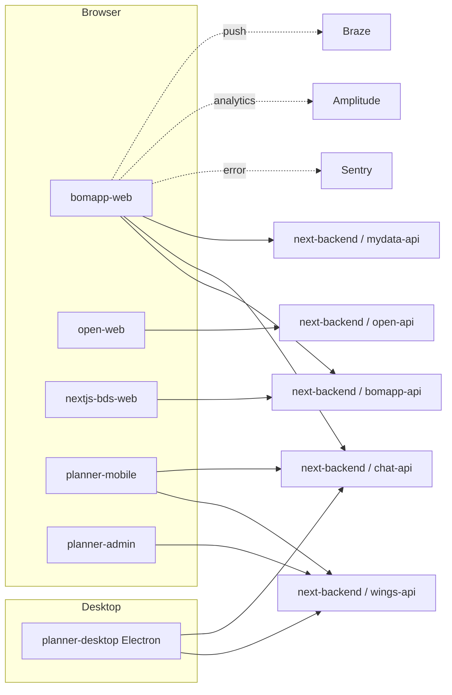

# next-frontend

> BOMAPP 차세대 프론트엔드 모노레포. Yarn workspaces 로 6개 웹/모바일/데스크톱/어드민 앱을 함께 관리하며 Vue 3 + Vite + Tailwind 스택 사용.

| 항목 | 값 |
|------|----|
| 경로 | `../next-frontend` |
| 리포 | `gitlab.bomapp.co.kr/bomapp/next-frontend` (project id 14, default `main`) |
| 언어/플랫폼 | TypeScript 5.8 / Vue 3.5 / Vite 7 / Yarn workspaces |
| 첫 커밋 | 2023-06-16 |
| main 커밋(2026-06-23 조회) | `e5e50fed` (2026-06-23, `fix(planner): 채팅 소켓 백그라운드 전환 시 isConnecting 고아로 재연결 불가 수정 (PLA-122)`) |
| 총 커밋 수 | 2,936 |
| 최근 6개월 | 619 커밋 |
| 주요 브랜치 | `main`(HEAD), `prod`, `staging`, `develop` |

---

## 1. 책임

- **고객용 웹** (보험 검색·상담·가입)
- **공개 건강검진 → 보험 추천 웹**
- **설계사 PC/모바일/모바일웹/어드민** 도구
- **차세대 BDS 웹** (브랜드 디자인 시스템 또는 비즈니스 데이터 서비스 — 추정)

next-backend 의 API(`bomapp-api`, `mydata-api`, `open-api`, `chat-api`, `wings-api`)를 axios + TanStack Query 로 호출.

---

## 2. 앱 카탈로그 (7개 + shared)

```
next-frontend/
├── shared/                 # 공통 컴포넌트 / 유틸 / 타입
├── types/                  # TypeScript 타입 공유
├── bomapp-web/             # 보맵 메인 고객 웹 (SPA)
├── bomapp-next-web/        # 보맵 재설계 웹 (신버전, 추정)
├── open-web/               # 공개 건강검진 → 보험 추천 (SPA)
├── nextjs-bds-web/         # BDS 웹 (Next.js, 추정)
├── planner-mobile/         # 설계사 모바일 웹앱
├── planner-desktop/        # 설계사 데스크톱 (Electron)
└── planner-admin/          # 관리자 패널 (SPA)
```

> 노션 자료(`Planner -FrontEnd`)에 따르면 `planner-mobile`(public/tools 영역)과 `planner-desktop` 이 공통 코드를 공유하며 Pinia 도입 검토 중. PROD ECS 측에는 `prod-next-frontend-was` 단일 task(port 3000-3002)가 `PROD-FRONT-NEXT` 클러스터에서 별도로 동작하는데, 이는 SSR 또는 Next.js 전용으로 추정됨 (`nextjs-bds-web`). (인스턴스 타입은 2026-05-19 시점 미재검증)

---

## 3. 앱별 상세

### 3.1 bomapp-web (보맵 메인 고객 웹)

- 도메인:
  - DEV `dev-web.bomapp.co.kr` → CloudFront → `s3://bomapp-static-dev-web`
  - STG `stg-web.bomapp.co.kr` → CloudFront → `s3://bomapp-static-stg-web`
  - PROD: `cloudfront.bomapp.co.kr` 외 다수 (정적 리소스), 메인 진입은 `az.bomappworks.com` 경유 PROD-ALB:3001 (legacy front)
- 주요 라우트:
  - `/` — 메인
  - `/auth/*` — 인증
  - `/insurance/*` — 보험 상품 검색/조회/가입
  - `/consultation/*` — 상담
  - `/chat/*` — 실시간 채팅
- 호출 백엔드: `bomapp-api`, `chat-api`, `mydata-api`

### 3.2 open-web (공개 건강검진 기반 보험 추천)

- 도메인:
  - DEV `dev-open.bomapp.co.kr` → CloudFront → `s3://bomapp-static-dev-web` (DEV 는 web 과 버킷 공유)
  - STG/PROD: 해당 도메인 미발견 (정의되지 않은 듯, 추정)
- 주요 라우트:
  - `/health-check` — 건강검진 정보 입력
  - `/health-check/forms` — 입력 폼
  - `/health-check/cover` — 보장 설계
  - `/health-check/result` — 추천 결과
  - `/recommend` — 일반 보험 추천
- 호출 백엔드: `open-api`

### 3.3 planner-mobile (설계사 모바일 웹앱)

- 도메인:
  - DEV `dev-dplanner.bomapp.co.kr` → CloudFront → `s3://bomapp-static-dev-dplanner`
  - STG `stg-dplanner.bomapp.co.kr`
- 주요 라우트:
  - `/m` — 모바일 진입
  - `/login`, `/pin-auth` — 인증
  - `/customer/{memberType}` — 고객 관리
  - `/consultation/*` — 상담
- 호출 백엔드: `wings-api`, `chat-api`

### 3.4 planner-desktop (설계사 데스크톱 — Electron)

- 도메인:
  - DEV `dev-planner.bomapp.co.kr`
  - STG `stg-planner.bomapp.co.kr`
- 주요 라우트:
  - `/login` — 로그인
  - `/dashboard` — 대시보드
  - `/customers` — 고객
  - `/chat/*` — 채팅
  - `/templates/*` — 설계 템플릿
- 호출 백엔드: `wings-api`, `chat-api`

### 3.5 planner-admin (관리자 패널)

- 도메인:
  - DEV `dev-padmin.bomapp.co.kr`
  - STG `stg-padmin.bomapp.co.kr`
- 주요 라우트:
  - `/admin` — 대시보드
  - `/users/*` — 사용자 관리
  - `/templates/*` — 컨텐츠 관리
- 호출 백엔드: `wings-api`

> `planner-admin` 은 설계사/플래너 도구 영역의 어드민이다. 레거시 redmin 대체용 내부 운영 콘솔은 별도 리포 [`bomapp-console`](./bomapp-console.md) 로 관리한다.

### 3.6 nextjs-bds-web (BDS 웹)

- 추정: Next.js 기반. PROD 의 `prod-next-frontend-was` ECS task(`PROD-FRONT-NEXT` 클러스터, port 3000-3002) 가 이 앱의 SSR 일 가능성 높음.
- 도메인 매핑은 정적 파일(CloudFront)이 아닌 **PROD-FRONT-NEXT 클러스터** 의 ECS 서비스가 담당.

### 3.7 bomapp-next-web

- 추정: 보맵 메인 웹의 차세대 재설계 (`-next-` prefix). 별도 도메인 매핑은 발견되지 않음.

---

## 4. 기술 스택

| 영역 | 라이브러리 | 버전 |
|------|----------|------|
| 프레임워크 | Vue | 3.5.21 |
| 라우터 | Vue Router | 4.5.1 |
| 상태 관리 | Pinia | 3.0.0 |
| 빌드 | Vite | 7.3.0 |
| 언어 | TypeScript | 5.8.3 |
| UI | TailwindCSS | 3.4.17 |
| UI 컴포넌트 | Reka UI | 2.2.0 |
| HTTP | Axios | 1.2.2 |
| 서버 상태 | TanStack Vue Query | 5.66.0 |
| 에러 추적 | Sentry Vue | 10.40.0 |
| WebSocket | SockJS + STOMP | — |
| 캐러셀/UX | Swiper | 9.0.4 |
| 캡처 | HTML2Canvas | 1.4.1 |
| 분석 | Amplitude, Braze, Airbridge | — |

패키지 매니저: **Yarn 1.22.22** (workspaces).

---

## 5. 환경 / 배포

### 5.1 환경 분리
- 각 앱마다 `.env.dev` / `.env.stg` / `.env.prod`
- API base URL, Sentry DSN, Amplitude project ID 등을 `VITE_*` 변수로 주입

### 5.2 CI/CD (GitLab CI/CD)
- `.gitlab-ci.yml`
- 브랜치 → 환경 매핑:
  - `develop` → dev (자동 빌드, 수동 배포)
  - `staging` → stg (자동 빌드, 수동 배포)
  - `main` → prod (자동 빌드, 수동 배포)
- 2026-04 부터 피쳐 브랜치 임시 배포 지원

### 5.3 배포 산출물
- 정적 SPA: Vite 빌드 → S3 (`bomapp-static-{env}-{app}`) 업로드 → CloudFront 무효화
- Next.js (`nextjs-bds-web` 추정): ECS task (`prod-next-frontend-was`)
- Electron (`planner-desktop`): 설계사 PC 에 배포 (별도 채널)

### 5.4 도메인 → CloudFront → S3 매핑

| 환경 | 도메인 | CloudFront | S3 버킷 |
|------|--------|-----------|---------|
| DEV | `dev-web.bomapp.co.kr` | OAC | `bomapp-static-dev-web` |
| DEV | `dev-open.bomapp.co.kr` | OAC | `bomapp-static-dev-web` (공유) |
| DEV | `dev-padmin.bomapp.co.kr` | OAC | `bomapp-static-dev-padmin` |
| DEV | `dev-planner.bomapp.co.kr` | OAC | `bomapp-static-dev-planner` |
| DEV | `dev-dplanner.bomapp.co.kr` | OAC | `bomapp-static-dev-dplanner` |
| STG | `stg-web.bomapp.co.kr` | OAC | `bomapp-static-stg-web` |
| STG | `stg-padmin.bomapp.co.kr` | OAC | `bomapp-static-stg-padmin` |
| STG | `stg-planner.bomapp.co.kr` | OAC | `bomapp-static-stg-planner` |
| STG | `stg-dplanner.bomapp.co.kr` | OAC | `bomapp-static-stg-dplanner` |
| PROD | `cloudfront.bomapp.co.kr` 외 | distribution | (다수) |

---

## 6. 의존 관계



---

## 7. 히스토리 마일스톤

| 시기 | 변경 |
|------|------|
| 2023-06 | 초기 모노레포 구축 (Vue 3, Vite) |
| 2024 | 플래너 모바일/데스크톱 앱 개발 진행 |
| 2025 | 보맵웹 재설계, 기능 확장 |
| 2026-04 | 피쳐 브랜치 임시 배포 지원 (dev/stg 수동) |
| 2026-04~05 | 채팅 UI 개선, 건강검진 알림톡 기능, 카카오페이 고객 알림 |

---

## 8. 알려진 이슈

- **테스트/린트 누락**: package.json 에 test/lint 스크립트가 정의되지 않음 → 변경 시 빌드(`yarn build`)만으로 1차 검증
- **PROD 도메인 매핑 일관성 부족**: 정적 사이트가 CloudFront 별 distribution 으로 분산되어 있어 환경 prefix 패턴이 일관적이지 않음
- **prod-next-frontend-was** ECS task 가 awslogs 미설정 (P0, ECS 감사)

---

## 9. 관련 문서

- [`../architecture.md`](../architecture.md)
- [`./next-backend.md`](./next-backend.md) — 호출 백엔드 상세
- 노션: `Planner -FrontEnd`
